# **KS0464 Keyestudio Smart Little Turtle Robot V3**

## 1. Introduction

Nowadays, technological education such as VR, kids programming, and artificial
intelligence, has become a mainstream in educational industry. Thereby, people
attach more importance to STEAM education. Arduino is notably famous for Maker
education.

So what is Arduino? Arduino is an open-source electronics platform based on
easy-to-use hardware and software. Arduino boards are able to read inputs -
light on a sensor, a finger on a button, or a Twitter message - and turn it into
an output - activating a motor, turning on an LED, publishing something online.
Based on this, Keyestudio team has designed a turtle robot. It has a processor
which is programmable using the Arduino IDE, to map its pins to sensors and
actuators by a shield that plug in the processor, and it reads sensors and
controls the actuators and decides how to operate.

This product boasts 15 learning projects, from simple to complex, which will
guide you to make a smart turtle robot all by yourself and introduce the
detailed knowledge about sensors and modules.

Moreover, it is the best choice if you intend to obtain a DIY robot for learning
programming, entertainment and competition.

## 2. Features

Multi-purpose function: Multi-purpose function: Obstacle avoidance,
    following, IR remote control, Bluetooth control, ultrasonic following and
    facial emoticons display.

Simple assembly: No soldering circuit required, complete assembly easily.

High Tenacity: Aluminum alloy bracket, metal motors, high quality wheels and
tracks

High extension: expand other sensors and modules through motor driver shield
and sensor shield

Multiple controls: IR remote control, App control(iOS and Android system)

Basic programming：C language code of Arduino IDE.

## 3. Specification

Working voltage: 5v

Input voltage: 7-12V

Maximum output current: 2A

Maximum power dissipation: 25W (T=75℃)

Motor speed: 5V 63 rpm/min

Motor drive mode: dual H bridge drive

Ultrasonic induction angle: \<15 degrees

Ultrasonic detection distance: 2cm-400cm

Infrared remote control distance: 10M (measured)

Bluetooth remote control distance: 50M(measured)

Bluetooth control: support Android and iOS system

## 4. Product Kit

## 5. Assembly Guide

**Note: Peel the plastic film off the board first when installing the smart car.
To be honest, we never intend to send wood to you.**

**Step 1: Bottom Motor Wheel**

Prepare the parts as follows:

-   M3\*6MM Round Head Screw \*2

-   M3\*6MM Flat Head Screw \*2

-   M3 Nickel Plated Nut \*2

-   Bottom PCB\*1

-   Tracking Sensor \*1

-   Universal Caster \*2

**  
**

**Step 2:Assemble Parts**

Prepare the parts as follows:

-   M3\*6MM Round Head Screw \*2

-   M2 Nut \*4

-   12FN20 Motor \*2

-   U-type Holder\* 2

-   N20 Motor Wheel \*2

-   2P Wire \*2

-   5P Wire \*1

-   M2\*12MM Round Head Screw \*4

-   2-cell AA Battery Holder \*1

-   M3\*6M Flat Head Screw \*2

-   M3 Nut \*2

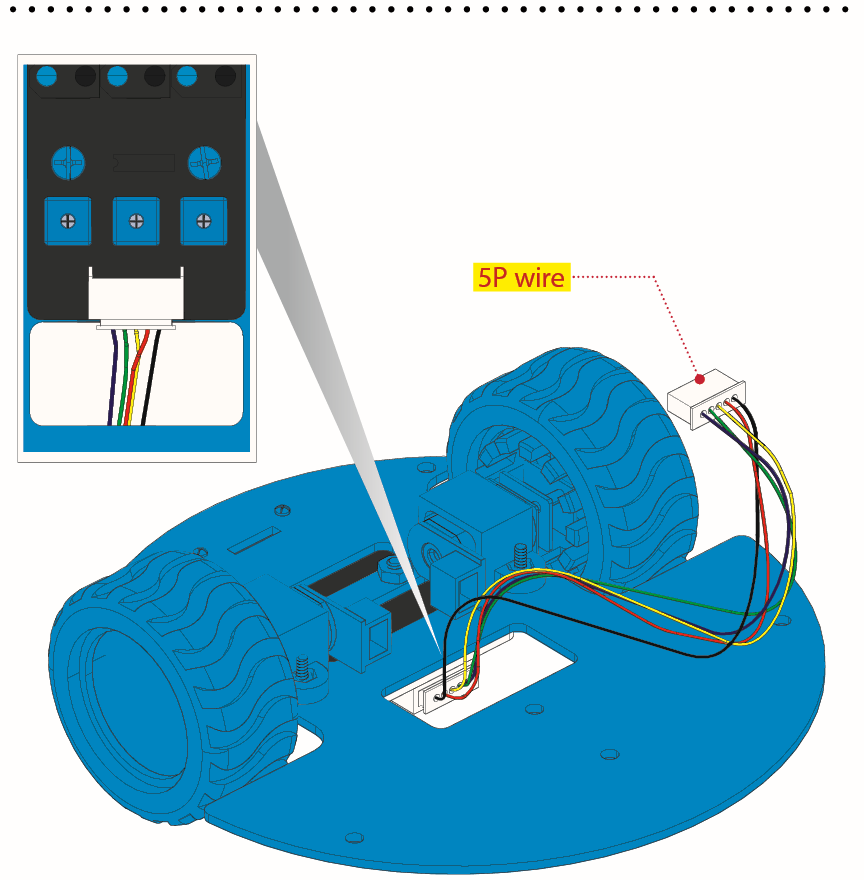

**Step 3: Install Top PCB**

Prepare the parts as follows:

-   Top PCB \*1

-   M3 Nut \*1

-   M3\*6MM Round Head Screw \*9

-   M3\*10MM Hexagon Copper Bush \*8

-   IR Receiver Sensor \*1

**Step 4: Mount Control Board**

Prepare the parts as follows:

-   V4.0 Board\*1

-   Motor Drive Shield V2\*1

-   M3\*6MM Round Head Screw \*4

**Step 5: Servo Plastic Platform**

Prepare the parts as follows:

-   Servo \*1

-   M2\*4 Screw \*1

-   Black Tie\*2

-   Ultrasonic Sensor\*1

-   Black Plastic Platform \*1

-   M1.2\*4 Tapping Screw \*4

-   M2\*8 Tapping Screw \*2

**Step 6: Final Assembly**

Prepare the parts as follows:

-   M3\*6MM Round Head Screw \*12

-   M3\*40MM Hexagon Copper Bush\*4

-   8x8 Dot Matrix \*1

-   Jumper Wire \*4

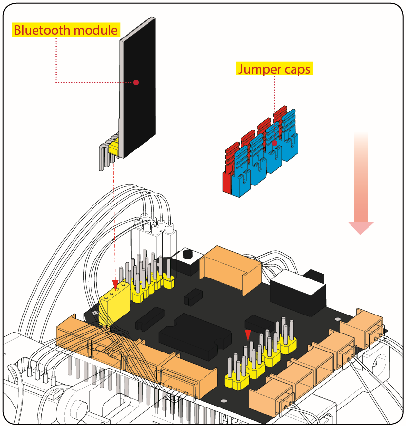

**Step 7: Hook-up Guide**

## 6. Getting Started with Arduino

When you get control board, you need to download Arduino IDE and driver firstly.

You could download Arduino IDE from the official website:

<https://www.arduino.cc/>, click the **SOFTWARE** on the browse bar,
click“DOWNLOADS” to enter download page, as shown below:

There are various versions of IDE for Arduino. Just download a version
compatible with your system. Here we will show you how to download and install
the windows version of Arduino IDE.

There are two versions of IDE for WINDOWS system. You can choose between the
installer (.exe) and the Zip file. For installer, it can be directly downloaded,
without the need of installing it manually while for Zip package, you will need
to install the driver manually.

Click JUST DOWNLOAD.

1.  **Keyestudio V4.0 Development Board**

You need to know that keyestudio V4.0 development board is the core of this
smart turtle robot .

Keyestudio V4.0 development board is an Arduino uno -compatible board, which is
based on ATmega328P MCU, and with a cp2102 Chip as a UART-to-USB converter.

It has 14 digital input/output pins (of which 6 can be used as PWM outputs), 6
analog inputs, a 16 MHz quartz crystal, a USB connection, a power jack, 2 ICSP
headers and a reset button.

It contains everything needed to support the microcontroller; simply connect it
to a computer with a USB cable or power it via an external DC power jack (DC
7-12V) or via female headers Vin/ GND(DC 7-12V) to get started.

| Microcontroller             | ATmega328P-PU                                            |
|-----------------------------|----------------------------------------------------------|
| Operating Voltage           | 5V                                                       |
| Input Voltage (recommended) | DC7-12V                                                  |
| Digital I/O Pins            | 14 (D0-D13)  (of which 6 provide PWM output)             |
| PWM Digital I/O Pins        | 6 (D3, D5, D6, D9, D10, D11)                             |
| Analog Input Pins           | 6 (A0-A5)                                                |
| DC Current per I/O Pin      | 20 mA                                                    |
| DC Current for 3.3V Pin     | 50 mA                                                    |
| Flash Memory                | 32 KB (ATmega328P-PU) of which 0.5 KB used by bootloader |
| SRAM                        | 2 KB (ATmega328P-PU)                                     |
| EEPROM                      | 1 KB (ATmega328P-PU)                                     |
| Clock Speed                 | 16 MHz                                                   |
| LED_BUILTIN                 | D13                                                      |

1.  **Installing V4.0 board Driver**

Let’s install the driver of keyestudio V4.0 board. The USB-TTL chip on V4.0
board adopts CP2102 serial chip. The driver program of this chip is included in
Arduino 1.8 version and above, which is convenient. Plug on USB port of board,
the computer can recognize the hardware and automatically install the driver of
CP2102.

If you install it unsuccessfully, or intend to install it manually, please open
the device manager of computer. Right click Computer----- Properties----- Device
Manager

The yellow exclamation mark on the page implies an unsuccessful installation and
you should double click the hardware and update the driver.

Click“OK”to enter the following page, click“browse my computer for updated
driver software”, find the installed or downloaded ARDUINO software. As shown
below:

There is a DRIVERS folder in Arduino software installed
package（）, open driver folder
and you can see the driver of CP210X series chips.

Click“Browse”, then find the driver folder, or you could enter “driver” to
search in rectangular box, then click“next”, the driver will be installed
successfully. (I place Arduino software folder on the desktop, you could follow
my suit.)

Open device manager, you will find the yellow exclamation mark disappear. The
driver of CP2102 is installed successfully.

1.  **Install other visions of driver**

If your development board is Arduino board, install the driver as follows:

Step 1: Plug in the development board, click Computer----- Properties-----
Device Manager, you could see the unknown device is shown.

Step 2: Update the driver

Step 3: click“browse my computer for updated driver software”

Step 4: find out the folder where the ARDUINO software is installed, click
**drivers** folder and tap“Next”

Step 5: the driver is installed successfully.

The device manager shows the serial port of Arduino.

1.  **Arduino IDE Setting**

Clickicon，open Arduino IDE.

To avoid the errors when uploading the program to the board, you need to select
the correct Arduino board that matches the board connected to your computer.

Then come back to the Arduino software, you should click Tools→Board, select the
board. (as shown below)

Then select the correct COM port (you can see the corresponding COM port after
the driver is successfully installed)

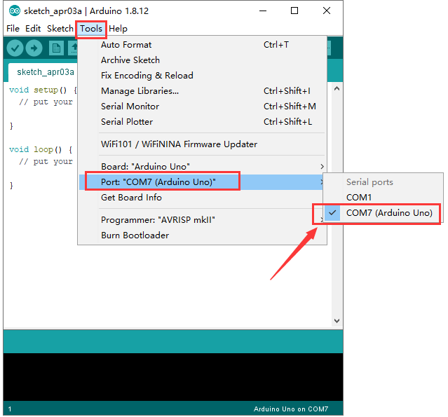

Before uploading the program to the board, let’s demonstrate the function of
each symbol in the Arduino IDE toolbar.

A- Used to verify whether there is any compiling mistakes or not.

B- Used to upload the sketch to your Arduino board.

C- Used to create shortcut window of a new sketch.

D- Used to directly open an example sketch.

E- Used to save the sketch.

F- Used to send the serial data received from board to the serial monitor.

1.  **Start First Program**

Open the file to select Example, choose BLINK from BASIC, as shown below:

Set board and COM port, the corresponding board and COM port are shown on the
lower right of IDE.

Clickto start compiling the
program, check errors.

Clickto upload the program,
upload successfully.

Upload the program successfully, the onboard LED lights on for 1s, lights off
for 1s. Congratulation, you have finished the first program.

**7. Add project Libraries**

**(1) What are Libraries ?**

[Libraries](https://www.arduino.cc/en/Reference/Libraries) are a collection of
code that makes it easy for you to drive a sensor,display, module, etc.

For example, the built-in LiquidCrystal library helps talk to LCD displays.
There are hundreds of additional libraries available on the Internet for
download.

The built-in libraries and some of these additional libraries are listed in the
reference.

**(2) How to Install a Library ?**

Here we will introduce the most simple way for you to add libraries .

**Step 1：**After downloading well the Arduino IDE, you can right-click the icon
of Arduino IDE.

Find the option "Open file location" shown as below:

**Step 2:** Enter it to find out libraries folder, this folder is the library
file of Arduino.

**Step 3：** Next to find out the“libraries”folders of turtle robot(seen in the
link: https://fs.keyestudio.com/KS0464), you just need to replicate and paste it
into the libraries folder of Arduino IDE.

Then the libraries of turtle robot are installed successfully, as shown below:

## 7. Projects

The whole project begins with basic programs. Starting from simple to complex,
the lessons will guide you to assemble the robot car and absorb the knowledge of
electronic and machinery step by step. I reckon that you could hardly sit still
and itch to have a go now. Let’s get started.

Note: (G), marked on each sensor and module, is the negative pole and connected
to “G”, ”-”or “GND”on the sensor shield or control board ; (V) is the positive
pole and linked with V , VCC, + or 5V on the sensor shield or control board.

### **Project 1: LED Blink**

1.  **Description**

For starters and enthusiasts, LED Blink is a fundamental program. LED, the
abbreviation of light emitting diodes, consists of Ga, As, P, N chemical
compounds and so on. The LED can flash in diverse color by altering the delay
time in the test code. When in control, power on GND and VCC, the LED will be on
if S end is in high level; nevertheless, it will go off.

1.  **Specification**

-   Control interface: digital port

-   Working voltage: DC 3.3-5V

-   Pin spacing: 2.54mm

-   LED display color: red

**(3) Components**

1.  **Wiring Diagram**

The expansion board is stacked on development board; LED module is connected to
G of shield;“+”is linked with 5V and S end is attached to D9.

1.  **Test Code**

/\*

keyestudio smart turtle robot

lesson 1.1

Blink

http://www.keyestudio.com

\*/

void setup()

{

pinMode(9, OUTPUT);// initialize digital pin 3 as an output.

}

void loop() // the loop function runs over and over again forever

{

digitalWrite(9, HIGH); // turn the LED on (HIGH is the voltage level)

delay(1000); // wait for a second

digitalWrite(9, LOW); // turn the LED off by making the voltage LOW

delay(1000); // wait for a second

}

//

1.  **Test Result：**

Upload the program, then LED flashes at the interval of 1s.

1.  **Code Explanation**

**pinMode(9，OUTPUT)** - This function can denote that the pin is INPUT or
OUTPUT

**digitalWrite(9，HIGH)** - When pin is OUTPUT, we can set it to HIGH(output 5V)
or LOW(output 0V)

1.  **Extension Practice**

We have succeeded in blinking LED. Next, let’s observe what will happen to the
LED if we modify pins and delay time.

/\*

keyestudio smart turtle robot

lesson 1.2

delay

http://www.keyestudio.com

\*/

void setup()

{

// initialize digital pin 11 as an output.

pinMode(9, OUTPUT);

}

// the loop function runs over and over again forever

void loop()

{

digitalWrite(9, HIGH); // turn the LED on (HIGH is the voltage level)

delay(100); // wait for 0.1 second

digitalWrite(9, LOW); // turn the LED off by making the voltage LOW

delay(100); // wait for 0.1 second

}

//

The test result shows that the LED flashes faster. Therefore, pins and time
delaying affect flash frequency.

**Project 2: Adjust LED Brightness**

**(1) Description**

In previous lesson, we control LED on and off and make it blink.

In this project, we will control LED’s brightness through PWM simulating
breathing effect. Similarly, you can change the step length and delay time in
the code so as to demonstrate different breathing effects.

PWM is a means of controlling the analog output via digital means. Digital
control is used to generate square waves with different duty cycles (a signal
that constantly switches between high and low levels) to control the analog
output.In general, the input voltages of ports are 0V and 5V. What if the 3V is
required? Or a switch among 1V, 3V and 3.5V? We cannot change resistors
constantly. For this reason, we resort to PWM.

For the Arduino digital port voltage output, there are only LOW and HIGH, which
correspond to the voltage output of 0V and 5V. You can define LOW as 0 and HIGH
as 1, and let the Arduino output five hundred 0 or 1 signals within 1 second.

If output five hundred 1, that is 5V; if all of which is 1, that is 0V. If
output 010101010101 in this way then the output port is 2.5V, which is like
showing movie. The movie we watch are not completely continuous. It actually
outputs 25 pictures per second. In this case, the human can’t tell it, neither
does PWM. If want different voltage, need to control the ratio of 0 and 1. The
more 0,1 signals output per unit time, the more accurately control.

**(2) Components needed**

1.  **Hook-up Diagram**

1.  **Test Code：**

/\*

keyestudio smart turtle robot

lesson 2.1

pwm

http://www.keyestudio.com

\*/

int ledPin = 9; // Define the LED pin at D9

int value;

void setup () {

pinMode (ledPin, OUTPUT); // initialize ledpin as an output.

}

void loop () {

for (value = 0; value \<255; value = value + 1)

{

analogWrite (ledPin, value); // LED lights gradually light up

delay (5); // delay 5MS

}

for (value = 255; value\> 0; value = value-1)

{

analogWrite (ledPin, value); // LED gradually goes out

delay (5); // delay 5MS

}

}

**(5) Test Result：**

Upload test code successfully, LED gradually changes from bright to dark, like
human’s breath, rather than turning on and off immediately.

**(6) Code Explanation**

To repeat some certain statements, we could use FOR statement.

FOR statement format is shown below:

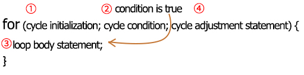

FOR cyclic sequence:

Round 1：1 → 2 → 3 → 4

Round 2：2 → 3 → 4

…

Until number 2 is not established, “for”loop is over,

After knowing this order, go back to code:

**for (int value = 0; value \< 255; value=value+1){**

**...}**

**for (int value = 255; value \>0; value=value-1){**

**...}**

The two“for”statements make value increase from 0 to 255, then reduce from 255
to 0, then increase to 255,....infinitely loop

There is a new function in the following ----- analogWrite()

We know that digital port only has two state of 0 and 1. So how to send an
analog value to a digital value? Here,this function is needed. Let’s observe the
Arduino board and find 6 pins marked“\~”which can output PWM signals.

Function format as follows:

**analogWrite(pin,value)**

analogWrite() is used to write an analog value from 0\~255 for PWM port, so the
value is in the range of 0\~255. Attention that you only write the digital pins
with PWM function, such as pin 3, 5, 6, 9, 10, 11.

PWM is a technology to obtain analog quantity through digital method. Digital
control forms a square wave, and the square wave signal only has two states of
turning on and off (that is, high or low levels). By controlling the ratio of
the duration of turning on and off, a voltage varying from 0 to 5V can be
simulated. The time turning on(academically referred to as high level) is called
pulse width, so PWM is also called pulse width modulation.

Through the following five square waves, let’s acknowledge more about PWM.

In the above figure, the green line represents a period, and value of
analogWrite() corresponds to a percentage which is called Duty Cycle as well.
Duty cycle implies that high-level duration is divided by low-level duration in
a cycle. From top to bottom, the duty cycle of first square wave is 0% and its
corresponding value is 0. The LED brightness is lowest, that is, light off. The
more time the high level lasts, the brighter the LED. Therefore, the last duty
cycle is 100%, which correspond to 255, and LED is the brightest. And 25% means
darker.

PWM mostly is used for adjusting the LED’s brightness or the rotation speed of
motors.

It plays a vital role in controlling smart robot cars. I believe that you cannot
wait to learn next project.

**(7) Extension Practice：**

Let’s modify the value of delay and remain the pin unchanged, then observe how
LED changes.

/\*

keyestudio smart turtle robot

lesson 2.2

pwm

http://www.keyestudio.com

\*/

int ledPin = 9; // Define the LED pin at D9

void setup () {

pinMode(ledPin, OUTPUT); // initialize ledpin as an output.

}

void loop () {

for (int value = 0; value \<255; value = value + 1) {

analogWrite (ledPin, value); // LED lights gradually light up

delay (30); // delay 50MS

}

for (int value = 255; value\> 0; value = value-1) {

analogWrite (ledPin, value); // LED gradually goes out

delay (30); // delay 50MS

}

}

//

Upload the code to development board, then LED blinks more slowly.

#### Project 3 : Line Tracking Sensor

1.  **Description**

The tracking sensor is
actually an infrared sensor. The component used here is the TCRT5000 infrared
tube.

Its working principle is to use different reflectivity of infrared light to
colors, then convert the strength of the reflected signal into a current signal.

During the process of detection, black is active at HIGH level while white is
active at LOW level. The detection height is 0-3 cm.

Keyestudio 3-channel line tracking module has integrated 3 sets of TCRT5000
infrared tube on a single board, which is more convenient for wiring and
control.

By rotating the adjustable potentiometer on the sensor, it can adjust the
detection sensitivity of the sensor.

1.  **Specification：**

Operating Voltage: 3.3-5V (DC)

Interface: 5PIN

Output Signal: Digital signal

Detection Height: 0-3 cm

Special note: before testing, rotate the potentiometer on the sensor to adjust
the detection sensitivity. When adjust the LED at the threshold between ON and
OFF, the sensitivity is the best.

**(3) Components**

**(4) Connection Diagram：**

1.  **Test Code**

/\*

keyestudio smart turtle robot

lesson 3.1

Line Track sensor

http://www.keyestudio.com

\*/

int L_pin = 11; //pins of left line tracking sensor

int M_pin = 7; //pins of middle line tracking sensor

int R_pin = 8; //pins of right line tracking sensor

int val_L,val_R,val_M;// define the variable value of three sensors

void setup()

{

Serial.begin(9600); // initialize serial communication at 9600 bits per second

pinMode(L_pin,INPUT); // make the L_pin as an input

pinMode(M_pin,INPUT); // make the M_pin as an input

pinMode(R_pin,INPUT); // make the R_pin as an input

}

void loop()

{

val_L = digitalRead(L_pin);//read the L_pin:

val_R = digitalRead(R_pin);//read the R_pin:

val_M = digitalRead(M_pin);//read the M_pin:

Serial.print("left:");

Serial.print(val_L);

Serial.print(" middle:");

Serial.print(val_M);

Serial.print(" right:");

Serial.println(val_R);

delay(500);// delay in between reads for stability

}

//

1.  Test Result：

Upload the code on development board, and open serial monitor. The displayed
value is 1(high level) when no signal is received. The value shifts into 0 when
the sensor is covered with paper.

1.  Code Explanation

**Serial.begin(9600)**- Initialize serial port, set baud rate to 9600

**pinMode-** Define the pin as input or output mode

**digitalRead-**Read the state of pin, which are generally HIGH and LOW level

1.  Extension Practice

After knowing its working principle, you can connect an LED to D9 so as to
control LED by it.

**Test Code**

/\*

keyestudio smart turtle robot

lesson 3.2

Line Track sensor

http://www.keyestudio.com

\*/

int L_pin = 11; //pins of left line tracking sensor

int M_pin = 7; //pins of middle line tracking sensor

int R_pin = 8; //pins of right line tracking sensor

int val_L,val_R,val_M;// define the variables of three sensors

void setup()

{

Serial.begin(9600); // initialize serial communication at 9600 bits per second

pinMode(L_pin,INPUT); // make the L_pin as an input

pinMode(M_pin,INPUT); // make the M_pin as an input

pinMode(R_pin,INPUT); // make the R_pin as an input

pinMode(9, OUTPUT);

}

void loop()

{

val_L = digitalRead(L_pin);//read the L_pin:

val_R = digitalRead(R_pin);//read the R_pin:

val_M = digitalRead(M_pin);//read the M_pin:

Serial.print("left:");

Serial.print(val_L);

Serial.print(" middle:");

Serial.print(val_M);

Serial.print(" right:");

Serial.println(val_R);

delay(500);// delay in between reads for stability

if ((val_L == LOW) \|\| (val_M == LOW) \|\| (val_R == LOW))//if left line
tracking sensor detects signals

{

Serial.println("HIGH");

digitalWrite(9, HIGH);//LED is off

}

else//if left line tracking sensor doesn’t detect signals

{

Serial.println("LOW");

digitalWrite(9, LOW);//LED is off

}

}

//

Upload the code to development board, then we could find LED light up when
covering the line tracking sensor by hand

**Project 4: Servo Control**

1.  **Description**

Servo motor is a position control rotary actuator. It mainly consists of a
housing, a circuit board, a core-less motor, a gear and a position sensor. Its
working principle is that the servo receives the signal sent by MCUs or
receivers and produces a reference signal with a period of 20ms and width of
1.5ms, then compares the acquired DC bias voltage to the voltage of the
potentiometer and obtain the voltage difference output.

When the motor speed is constant, the potentiometer is driven to rotate through
the cascade reduction gear, which leads that the voltage difference is 0, and
the motor stops rotating. Generally, the angle range of servo rotation is 0°
\--180 °

The rotation angle of servo motor is controlled by regulating the duty cycle of
PWM (Pulse-Width Modulation) signal. The standard cycle of PWM signal is 20ms
(50Hz). Theoretically, the width is distributed between 1ms-2ms, but in fact,
it's between 0.5ms-2.5ms. The width corresponds the rotation angle from 0° to
180°. But note that for different brand motor, the same signal may have
different rotation angle.

The corresponding servo angles are shown below:

1.  **Specification**

-   Working voltage: DC 4.8V \~ 6V

-   Operating angle range: about 180 ° (at 500 → 2500 μsec)

-   Pulse width range: 500 → 2500 μsec

-   No-load speed: 0.12 ± 0.01 sec / 60 (DC 4.8V) 0.1 ± 0.01 sec / 60 (DC 6V)

-   No-load current: 200 ± 20mA (DC 4.8V) 220 ± 20mA (DC 6V)

-   Stopping torque: 1.3 ± 0.01kg · cm (DC 4.8V) 1.5 ± 0.1kg · cm (DC 6V)

-   Stop current: ≦ 850mA (DC 4.8V) ≦ 1000mA (DC 6V)

-   Standby current: 3 ± 1mA (DC 4.8V) 4 ± 1mA (DC 6V)

1.  **Equipment**

1.  **Connection Diagram：**

Wiring note: the brown line of servo is linked with Gnd(G), the red one is
connected to 5v(V) and the orange one is attached to digital 10.

The servo has to be connected to external power due to its high demand for
driving servo current. Generally, the current of development board is not big
enough. If without connected power, the development board could be burnt.

1.  **Test Code1：**

/\*

keyestudio smart turtle robot

lesson 4.1

Servo

http://www.keyestudio.com

\*/

\##define servoPin 10 //servo Pin

int pos; //the angle variable of servo

int pulsewidth; //pulse width variable of servo

void setup() {

pinMode(servoPin, OUTPUT); //set the pins of servo to output

procedure(0); //set the angle of servo to 0 degree

}

void loop() {

for (pos = 0; pos \<= 180; pos += 1) { // goes from 0 degrees to 180 degrees

// in steps of 1 degree

procedure(pos); // tell servo to go to position in variable 'pos'

delay(15); //control the rotation speed of servo

}

for (pos = 180; pos \>= 0; pos -= 1) { // goes from 180 degrees to 0 degrees

procedure(pos); // tell servo to go to position in variable 'pos'

delay(15);

}

}

//function to control servo

void procedure(int myangle) {

pulsewidth = myangle \* 11 + 500; //calculate the value of pulse width

digitalWrite(servoPin,HIGH);

delayMicroseconds(pulsewidth); //The duration of high level is pulse width

digitalWrite(servoPin,LOW);

delay((20 - pulsewidth / 1000)); //the cycle is 20ms, the low level last for the
rest of time

}

//

Upload code successfully, then servo swings back in the range of 0° to 180°

There is another guide for restraining servo---- servo library file, the
following link of official website is for your reference.

<https://www.arduino.cc/en/Reference/Servo>

The library file of servo is used in the following code

1.  **Test Code2:**

/\*

keyestudio smart turtle robot

lesson 4.2

servo

http://www.keyestudio.com

\*/

\##include \<Servo.h\>

Servo myservo; // create servo object to control a servo

// twelve servo objects can be created on most boards

int pos = 0; // variable to store the servo position

void setup() {

myservo.attach(10); // attaches the servo on pin 9 to the servo object

}

void loop() {

for (pos = 0; pos \<= 180; pos += 1) { // goes from 0 degrees to 180 degrees

// in steps of 1 degree

myservo.write(pos); // tell servo to go to position in variable 'pos'

delay(15); // waits 15ms for the servo to reach the position

}

for (pos = 180; pos \>= 0; pos -= 1) { // goes from 180 degrees to 0 degrees

myservo.write(pos); // tell servo to go to position in variable 'pos'

delay(15); // waits 15ms for the servo to reach the position

}

}

//\

1.  **Test Result：**

Upload code successfully and power on, then the servo swings in the range of 0°
to 180°. We usually control it by library file.

**(8) Code Explanation**

Arduino comes with **\##include \<Servo.h\>** (servo function and statement）

The following are some common statements of the servo function:

1\. **attach（interface）**——Set servo interface, port 9 and 10 are available

2\. **write（angle）**——Used for the statement to set rotation angle of servo,
and the set angle range is from 0° to 180°

3\. **read（）**——used for the statement to read angle of servo, namely, reading
the command value of“write()”

4\. **attached（）**——Judge if the parameter of servo is sent to its interface

Note: The above written format is“servo variable name, specific statement（）”,
for instance: myservo.attach(9)

#### Project 5: Ultrasonic Sensor

1.  **Description**

The HC-SR04 ultrasonic sensor
uses sonars to determine distance to an object like bats do. It offers excellent
non-contact range detection with high accuracy and stable readings in an
easy-to-use package. It comes complete with ultrasonic transmitter and receiver
modules.

The HC-SR04 or the ultrasonic sensor is being used in a wide range of
electronics projects for creating obstacle detection and distance measuring
application as well as various other applications. Here we have brought the
simple method to measure the distance with Arduino and ultrasonic sensor and how
to use ultrasonic sensor with Arduino.

**(2) Specification：**

-   Power Supply :+5V DC

-   Quiescent Current : \<2mA

-   Working Current: 15mA

-   Effectual Angle: \<15°

-   Ranging Distance : 2cm – 400 cm

-   Resolution : 0.3 cm

-   Measuring Angle: 30 degree

-   Trigger Input Pulse width: 10uS

**(3) Components**

**(4) The principle of ultrasonic sensor**

As the above picture shown, it is like two eyes. One is transmitting end, the
other is receiving end.

The ultrasonic module will emit the ultrasonic waves after triggering a signal.
When the ultrasonic waves encounter the object and are reflected back, the
module outputs an echo signal, so it can determine the distance of the object
from the time difference between the trigger signal and echo signal.

The t is the time that emitting signal meets obstacle and returns. And the
propagation speed of sound in the air is about 343m/s, and distance = speed \*
time. However, the ultrasonic wave emits and comes back, which is 2 times of
distance. Therefore, it needs to be divided by 2, the distance measured by
ultrasonic wave = (speed \* time)/2

| Use method and timing chart of ultrasonic module: Setting the delay time of Trig pin of SR04 to 10μs at least, which can trigger it to detect distance. 2. After triggering, the module will automatically send eight 40KHz ultrasonic pulses and detect whether there is a signal return. This step will be completed automatically by the module. 3. If the signal returns, the Echo pin will output a high level, and the duration of the high level is the time from the transmission of the ultrasonic wave to the return.  |
|---------------------------------------------------------------------------------------------------------------------------------------------------------------------------------------------------------------------------------------------------------------------------------------------------------------------------------------------------------------------------------------------------------------------------------------------------------------------------------------------------------------------------------------------------------------------------------|

Circuit diagram of ultrasonic sensor:

**(5) Connection Diagram**

****

Wiring guide:

Ultrasonic sensor keyestudio V5 sensor shield

VCC → 5v(V)

Trig → 12(S)

Echo → 13(S)

Gnd → Gnd(G)

1.  **Test Code：**

/\*

keyestudio smart turtle robot

lesson 5.1

Ultrasonic sensor

http://www.keyestudio.com

\*/

int trigPin = 12; // Trigger

int echoPin = 13; // Echo

long duration, cm, inches;

void setup() {

//Serial Port begin

Serial.begin (9600);

//Define inputs and outputs

pinMode(trigPin, OUTPUT);

pinMode(echoPin, INPUT);

}

void loop() {

// The sensor is triggered by a HIGH pulse of 10 or more microseconds.

// Give a short LOW pulse beforehand to ensure a clean HIGH pulse:

digitalWrite(trigPin, LOW);

delayMicroseconds(2);

digitalWrite(trigPin, HIGH);

delayMicroseconds(10);

digitalWrite(trigPin, LOW);

// Read the signal from the sensor: a HIGH pulse whose

// duration is the time (in microseconds) from the sending

// of the ping to the reception of its echo off of an object.

duration = pulseIn(echoPin, HIGH);

// Convert the time into a distance

cm = (duration/2) / 29.1; // Divide by 29.1 or multiply by 0.0343

inches = (duration/2) / 74; // Divide by 74 or multiply by 0.0135

Serial.print(inches);

Serial.print("in, ");

Serial.print(cm);

Serial.print("cm");

Serial.println();

delay(250);

}

//\

1.  **Test Result**

Upload test code on the development board, open serial monitor and set baud rate
to 9600. The detected distance will be displayed, and the unit is cm and inch.
Hinder the ultrasonic sensor by hand, the displayed distance value gets smaller.

1.  **Code Explanation**

**int trigPin-** this pin is defined to transmit ultrasonic waves, generally
output.

**int echoPin -** this is defined as the pin of reception, generally input

**cm = (duration/2) / 29.1-**

**inches = (duration/2) / 74-**

We can calculate the distance by using the following formula:

distance = (traveltime/2) x speed of sound

The speed of sound is: 343m/s = 0.0343 cm/uS = 1/29.1 cm/uS

Or in inches: 13503.9in/s = 0.0135in/uS = 1/74in/uS

We need to divide the traveltime by 2 because we have to take into account that
the wave was sent, hit the object, and then returned back to the sensor.

1.  **Extension Practice:**

We have just measured the distance displayed by the ultrasonic. How about
controlling the LED with the measured distance? Let's try it and connect an LED
light module to the D3 pin.

/\*

keyestudio smart turtle robot

lesson 5.2

Ultrasonic LED

http://www.keyestudio.com

\*/

int trigPin = 12; // Trigger

int echoPin = 13; // Echo

long duration, cm, inches;

void setup() {

Serial.begin (9600); //Serial Port begin

pinMode(trigPin, OUTPUT); //Define inputs and outputs

pinMode(echoPin, INPUT);

}

void loop()

{

// The sensor is triggered by a HIGH pulse of 10 or more microseconds.

// Give a short LOW pulse beforehand to ensure a clean HIGH pulse:

digitalWrite(trigPin, LOW);

delayMicroseconds(2);

digitalWrite(trigPin, HIGH);

delayMicroseconds(10);

digitalWrite(trigPin, LOW);

// Read the signal from the sensor: a HIGH pulse whose

// duration is the time (in microseconds) from the sending

// of the ping to the reception of its echo off of an object.

duration = pulseIn(echoPin, HIGH);

// Convert the time into a distance

cm = (duration/2) / 29.1; // Divide by 29.1 or multiply by 0.0343

inches = (duration/2) / 74; // Divide by 74 or multiply by 0.0135

Serial.print(inches);

Serial.print("in, ");

Serial.print(cm);

Serial.print("cm");

Serial.println();

delay(250);

if (cm\>=2 && cm\<=10)

{

Serial.println("HIGH");

digitalWrite(9, HIGH);

}

else

{

Serial.println("LOW");

digitalWrite(9, LOW);

}

}

//

Upload test code to development board and block ultrasonic sensor by hand, then
check if LED is on

**Project 6: IR Reception**

1.  Description

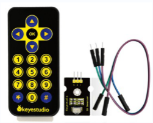

There is no doubt that infrared remote control is ubiquitous in daily life. It
is used to control various household appliances, such as TVs, stereos, video
recorders and satellite signal receivers. Infrared remote control is composed of
infrared transmitting and infrared receiving systems, that is, an infrared
remote control and infrared receiving module and a single-chip microcomputer
capable of decoding.​

The 38K infrared carrier signal emitted by remote controller is encoded by the
encoding chip in the remote controller. It is composed of a section of pilot
code, user code, user inverse code, data code, and data inverse code. The time
interval of the pulse is used to distinguish whether it is a 0 or 1 signal and
the encoding is made up of these 0, 1 signals.

The user code of the same remote control is constant while the data code can
distinguish the key.

When the remote control button is pressed, the remote control sends out an
infrared carrier signal. When the IR receiver receives the signal, the program
will decode the carrier signal and determines which key is pressed. The MCU
decodes the received 01 signal, thereby judging what key is pressed by the
remote control.

Infrared receiver we use is an infrared receiver module. Mainly composed of an
infrared receiver head, which is a device that integrates reception,
amplification, and demodulation. Its internal IC has completed demodulation, and
can achieve from infrared reception to output and be compatible with TTL
signals. Additionally, it is suitable for infrared remote control and infrared
data transmission. The infrared receiving module made by the receiver has only
three pins, signal line, VCC and GND. It is very convenient to communicate with
Arduino and other microcontrollers.

1.  **Specification**

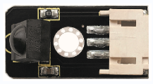

Operating Voltage: 3.3-5V（DC）

Interface: 3PIN

Output Signal: Digital signal

Receiving Angle: 90 degrees

Frequency: 38khz

Receiving Distance: 10m

(3) Components required

(4) Connection Diagram

Respectively link“-”,“+”and S of IR receiver module with G(GND）, V（VCC）and A0
of keyestudio development board.

Attention: On the condition that digital ports are not available, analog ports
can be regarded as digital ports. A0 equals to D14, A1 is equivalent to digital
15.

Import the library of IR receiver firstly before editing test code.

/\*

keyestudio smart turtle robot

lesson 6.1

IRremote

http://www.keyestudio.com

\*/

\##include \<IRremote.h\> //IRremote library statement

int RECV_PIN = A1; //define the pins of IR receiver as A1

IRrecv irrecv(RECV_PIN);

decode_results results; // decode results exist in the“result” of “decode
results”

void setup()

{

Serial.begin(9600);

irrecv.enableIRIn(); // Enable receiver

}

void loop() {

if (irrecv.decode(&results))//decode successfully, receive a set of infrared
signals

{

Serial.println(results.value, HEX);//Wrap word in 16 HEX to output and receive
code

irrecv.resume(); // Receive the next value

}

delay(100);

}

//

1.  Test Result：

Upload test code, open serial monitor and set baud rate to 9600, point remote
control to IR receiver. Then the corresponding value will be shown. If the code
is pressed too long, the error codes will appear.

The keys value of Keyestudio remote control are shown below.

1.  Code Explanation

**irrecv.enableIRIn():** after enabling IR decoding, the IR signals will be
received, then function“decode()”will check continuously to make ure if decoding
successfully.

**irrecv.decode(&results):** after decoding successfully, this function will
come back to “true”, and keep result in “results”. After decoding a IR signals,
run the resume()function and continue to receive the next signal.

1.  Extension Practice：

We decoded the key value of IR remote control. How about controlling LED by the
measured value? We could design an experiment.

Attach an LED to D3, then press the keys of remote control to make LED light on
and off.

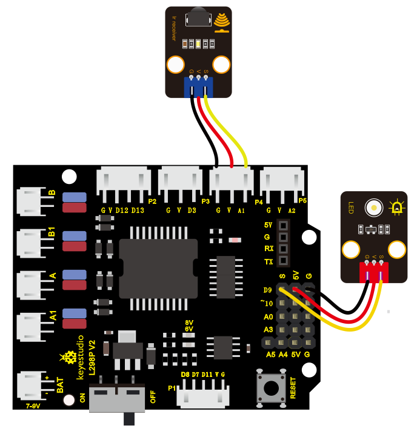

/\*

keyestudio smart turtle robot

lesson 6.2

IRremote

http://www.keyestudio.com

\*/

\##include \<IRremote.h\>

int RECV_PIN = A1;//define the pin of IR receiver as A1

int LED_PIN=9;//define the pin of LED as pin 9

int a=0;

IRrecv irrecv(RECV_PIN);

decode_results results;

void setup()

{Serial.begin(9600);

irrecv.enableIRIn(); //Initialize the IR receiver

pinMode(LED_PIN,OUTPUT);//set pin 4 of LED to OUTPUT

}

void loop() {

if (irrecv.decode(&results))

{

if(results.value==0xFF02FD && (a==0)) //according to the above key value,
press“OK”on remote control , LED will be controlled

{

Serial.println("HIGH");

digitalWrite(LED_PIN,HIGH);//LED will be on

a=1;

}

else if(results.value==0xFF02FD && (a==1)) //press again

{

Serial.println("LOW");

digitalWrite(LED_PIN,LOW);//LED will go off

a=0;

}

irrecv.resume(); // receive the next value

}

}

//

Upload code to development board, press“OK”key on remote control to make LED on
and off.

**Project 7: Bluetooth Remote Control**

1.  **Description**

Bluetooth, a simple wireless communication module, has went viral since the last
few decades and been used in most of the battery-powered devices for its
easy-to-use function.

Over the past years, there have
been many upgrades of Bluetooth standard to fulfil the demands of customers and
the development of technology as well as to follow the trend of time.

Over the few years, there are many things changed including data transmission
rate, power consumption with wearable and IoT Devices and Security System.

Here are we going to learn about HM-10 BLE 4.0 with Arduino Board? The HM-10 is
a readily available Bluetooth 4.0 module. This module is used for establishing
wireless data communication. The module is designed by using the Texas
Instruments CC2540 or CC2541 Bluetooth low energy (BLE) System on Chip (SoC).

1.  Specification:

Bluetooth protocol: Bluetooth
Specification V4.0 BLE

No byte limit in serial port Transceiving

In open environment, realize 100m ultra-distance communication with iphone4s

Working frequency: 2.4GHz ISM band

Modulation method: GFSK(Gaussian Frequency Shift Keying)

Transmission power: -23dbm, -6dbm, 0dbm, 6dbm, can be modified by AT command.

Sensitivity: ≤-84dBm at 0.1% BER

Transmission rate: Asynchronous: 6K bytes ; Synchronous: 6k Bytes

Security feature: Authentication and encryption

Supporting service: Central & Peripheral UUID FFE0, FFE1

Power consumption: Auto sleep mode, stand by current 400uA\~800uA, 8.5mA during
transmission.

Power supply: 5V DC

Working temperature: –5 to +65 Centigrade

1.  Components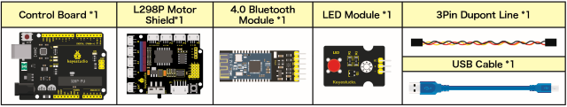

**(3) Connection Diagram**

**1. STATE:** *state test pins, connected to internal LED, generally keep it
unconnected.*

**2. RXD:** *serial interface, receiving terminal.*

**3. TXD:** *serial interface, transmitting terminal.*

**4. GND:** *Ground.*

**5. VCC:** *positive pole of the power source.*

**6. EN/BRK:** *break connect, it means breaking the Bluetooth connection,
generally, keep it unconnected.*

**Pay attention to the pin direction when inserting Bluetooth module, and don’t
insert it before uploading test code.**

1.  **Test Code**

/\*

keyestudio smart turtle robot

lesson 7.1

bluetooth

http://www.keyestudio.com

\*/

char ble_val; //character variable, used to store the value received by
Bluetooth

void setup() {

Serial.begin(9600);

}

void loop() {

if(Serial.available() \> 0) //make sure if there is data in serial buffer

{

ble_val = Serial.read(); //Read data from serial buffer

Serial.println(ble_val); //Print

}

}

//\

(There will be contradiction between serial communication of code and
communication of Bluetooth when uploading code. Therefore, don’t link Bluetooth
module before uploading code.)

After uploading code on development board, then insert Bluetooth module and wait
for the command from your cellphone.

**(5) Download APP**

The code is for reading the received signal, and we also need a device to send
signals. In this project, we send signals to control robot car via a cellphone.
So, we need to download the APP.

1.  **iOS system**

**Note: Allow APP to access“location”in settings of your cellphone when
connecting to Bluetooth module, as a result, Bluetooth may not be connected.**

Enter APP STORE to search **BLE Scanner 4.0 to download.**

1.  **Android system**

Enter [Google Play](https://developer.android.google.cn/distribute?hl=zh-cn) to
find out **BLE Scanner and download.**

**(Enable“location”in settings of your cellphone. Otherwise, app may not be
searched.)**

1.  After installation, open App and enable“Location and Bluetooth” permission.

1.  Open App, the name of Bluetooth module is HMSoft.

Then click “connect” to link it with Bluetooth

1.  After connecting to HMSoft, click it to get multiple options, such as device
    information, access permission, general and custom service. Choose “CUSTOM
    SERVICE”

1.  Then the following page pops up.

7\. Click（Read,Notify,WriteWithoutResponse)to enter the following page

8\. Click **Write Value to enter HEX or Text.**

9\. Open the serial monitor on Arduino, enter a 0 or other characters on Text
interface.

1.  Then click“Write”, and open serial monitor to view if there is a“0”signal

**(6)Code Explanation**

**Serial.available()** : The current rest characters when return to buffer area.
Generally, this function is used to judge if there is data in buffer. When
Serial.available()\>0, it means that serial receives the data and can be read

**Serial.read()：**Read a data of a Byte in buffer of serial port, for instance,
device sends data to Arduino via serial port, then we could read data by
“Serial.read()”

**(7)Extension Practice**

We could send a command via Bluetooth to turn a LED on and off.

D9 is connected to a LED, as shown below:

/\*

keyestudio smart turtle robot

lesson 7.2

Bluetooth

http://www.keyestudio.com

\*/

int ledpin=9;

void setup()

{

Serial.begin(9600);

pinMode(ledpin,OUTPUT);

}

void loop()

{

int i;

if (Serial.available())

{

i=Serial.read();

Serial.println("DATA RECEIVED:");

if(i=='1')

{

digitalWrite(ledpin,1);

Serial.println("led on");

}

if(i=='0')

{

digitalWrite(ledpin,0);

Serial.println("led off");

}

}

}

//

Click“Write”on APP. When you enter 1, LED will be on; when you input 0, it will
be off. (Remember to remove the Bluetooth module after finishing experiment.
Otherwise, burning code will be affected)

#### Project 8: Motor Driving and Speed Control

1.  Description

There are many ways to drive a motor. Our robot car uses the most common
solution--L298P--which is an excellent high-power motor driver IC produced by
STMicroelectronics. It can directly drive DC motors, two-phase and four-phase
stepping motors. The driving current is up to 2A, and the output terminal of
motor adopts eight high-speed Schottky diodes as protection.

We designed a shield based on the circuit of L298p.

The stacked design reduces the technical difficulty of using and driving the
motor.

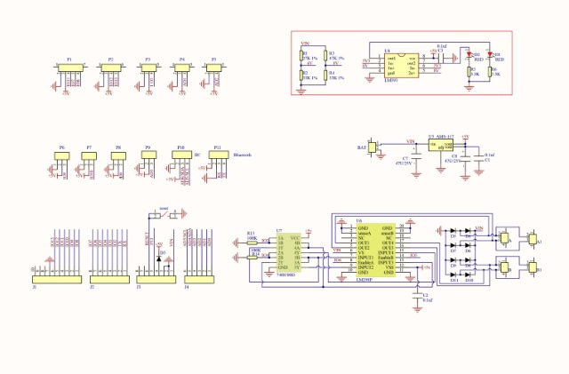

**(2) Specification**

Circuit Diagram for L298P Board

1.  Logic part input voltage: DC5V

2.  Driving part input voltage: DC 7-12V

3.  Logic part working current: \<36mA

4.  Driving part working current: \<2A

5.  Maximum power dissipation: 25W (T=75℃)

6.  Working temperature: -25℃～＋130℃

7.  Control signal input level: high level 2.3V\<Vin\<5V, low level
    \-0.3V\<Vin\<1.5V

**(3) Drive Robot to Move**

From the above diagram, it is known that the direction pin of B motor is D4; a
speed pin is D5; D2 is the direction pin of A motor; and D9 is speed pin.

PWM drives the robot car. The PWM value is in the range of 0-255. The larger the
number, the faster the rotation of the motor.

|                      | D2   | D6 (PWM) | Motor(A)             | D4   | D5 (PWM) | Motor（B）           |
|----------------------|------|----------|----------------------|------|----------|----------------------|
| Go forward           | LOW  | 200      | Rotate clockwise     | LOW  | 200      | Rotate clockwise     |
| Go back              | HIGH | 200      | Rotate anticlockwise | HIGH | 200      | Rotate anticlockwise |
| Rotate anticlockwise | HIGH | 200      | Rotate anticlockwise | LOW  | 200      | Rotate clockwise     |
| Rotate clockwise     | LOW  | 200      | Rotate clockwise     | HIGH | 200      | Rotate anticlockwise |
| Stop                 | /    | 0        | Stop                 | /    | 0        | Stop                 |

(4) Components

(5) Connection Diagram

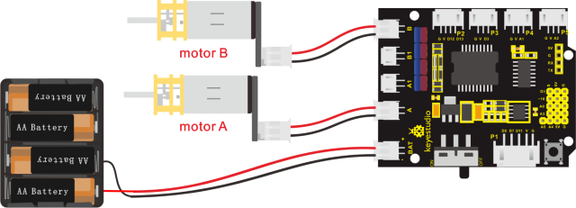

(6) Test Code：

/\*

keyestudio smart turtle robot

lesson 8.1

motor driver shield

http://www.keyestudio.com

\*/

\##define ML_Ctrl 2 //define the direction control pin of A motor

\##define ML_PWM 6 //define the PWM control pin of A motor

\##define MR_Ctrl 4 //define the direction control pin of B motor

\##define MR_PWM 5 //define the PWM control pin of B motor

void setup()

{

pinMode(ML_Ctrl, OUTPUT);//set direction control pin of A motor to output

pinMode(ML_PWM, OUTPUT);//set PWM control pin of A motor to output

pinMode(MR_Ctrl, OUTPUT);//set direction control pin of B motor to output

pinMode(MR_PWM, OUTPUT);//set PWM control pin of B motor to output

}

void loop()

{

//front

digitalWrite(ML_Ctrl,LOW);//set the direction control pin of A motor to LOW

analogWrite(ML_PWM,200);//set the PWM control speed of A motor to 200

digitalWrite(MR_Ctrl,LOW);//set the direction control pin of B motor to LOW

analogWrite(MR_PWM,200);// set the PWM control speed of B motor to 200

delay(2000);//delay in 2000ms

//back

digitalWrite(ML_Ctrl,HIGH);//set the direction control pin of A motor to HIGH
level

analogWrite(ML_PWM,200);// set the PWM control speed of A motor to 200

digitalWrite(MR_Ctrl,HIGH);//set the direction control pin of B motor to HIGH
level

analogWrite(MR_PWM,200);//set the PWM control speed of B motor to 200

delay(2000);//delay in 2000ms

//left

digitalWrite(ML_Ctrl,HIGH);//set the direction control pin of A motor to HIGH
level

analogWrite(ML_PWM,200);//set the PWM control speed of A motor to 200

digitalWrite(MR_Ctrl,LOW);//set the direction control pin of B motor to LOW
level

analogWrite(MR_PWM,200);//set the PWM control speed of B motor to 200

delay(2000);//delay in 2000ms

//right

digitalWrite(ML_Ctrl,LOW);//set the direction control pin of A motor to LOW
level

analogWrite(ML_PWM,200);//set the PWM control speed of A motor to 200

digitalWrite(MR_Ctrl,HIGH);// set the direction control pin of B motor to HIGH
level

analogWrite(MR_PWM,200);//set the PWM control speed of B motor to 200

delay(2000);//delay in 2000ms

//stop

analogWrite(ML_PWM,0);//set the PWM control speed of A motor to 0

analogWrite(MR_PWM,0);//set the PWM control speed of B motor to 0

delay(2000);// delay in 2000ms

}

//

1.  **Test Result：**

Hook up by connection diagram, upload code and power on, the smart car goes
forward and back for 2s, turns left and right for 2s, and stops for 2s
alternately.

1.  Code Explanation

**digitalWrite(ML_Ctrl,LOW):** the rotation direction of motor is decided by the
high/low level and and the pins that decide rotation direction are digital pins.

**analogWrite(ML_PWM,200):** the speed of motor is regulated by PWM, and the
pins that decide the speed of motor must be PWM pins.

1.  Extension Practice

Adjust the speed that PWM controls the motor, hook up in the same way.

/\*

keyestudio smart turtle robot

lesson 8.2

motor driver

http://www.keyestudio.com

\*/

\##define ML_Ctrl 2 //define the direction control pin of A motor

\##define ML_PWM 6 //define the PWM control pin of A motor

\##define MR_Ctrl 4 //define the direction control pin of B motor

\##define MR_PWM 5 //define the PWM control pin of B motor

void setup()

{ pinMode(ML_Ctrl, OUTPUT);//set the direction control pin of A motor to OUTPUT

pinMode(ML_PWM, OUTPUT);//set the PWM control pin of A motor to OUTPUT

pinMode(MR_Ctrl, OUTPUT);//set the direction control pin of B motor to OUTPUT

pinMode(MR_PWM, OUTPUT);//set the PWM control pin of B motor to OUTPUT

}

void loop()

{ digitalWrite(ML_Ctrl,LOW);//set the direction control pin of A motor to low
level

analogWrite(ML_PWM,100);//set the PWM control speed of A motor to 100

digitalWrite(MR_Ctrl,LOW);//set the direction control pin of B motor to low
level

analogWrite(MR_PWM,100);//set the PWM control speed of B motor to 100

//front

delay(2000);//delay in 2000ms

digitalWrite(ML_Ctrl,HIGH);//set the direction control pin of A motor to high
level

analogWrite(ML_PWM,100);//set the PWM control speed of A motor to 100

digitalWrite(MR_Ctrl,HIGH);//set the direction control pin of B motor to high
level

analogWrite(MR_PWM,100);//set the PWM control speed of B motor to 100

//back

delay(2000);//delay in 2000ms

digitalWrite(ML_Ctrl,HIGH);//set the direction control pin of A motor to HIGH
level

analogWrite(ML_PWM,100);// set the PWM control speed of A motor to 100

digitalWrite(MR_Ctrl,LOW);//set the direction control pin of B motor to LOW
level

analogWrite(MR_PWM,100);//set the PWM control speed of B motor to 100

//left

delay(2000);//delay in 2000ms

digitalWrite(ML_Ctrl,LOW);//set the direction control pin of A motor to LOW
level

analogWrite(ML_PWM,100);//100 set the PWM control speed of A motor to 100

digitalWrite(MR_Ctrl,HIGH);//set the direction control pin of B motor to HIGH
level

analogWrite(MR_PWM,100);//set the PWM control speed of B motor to 100

//right

delay(2000);//delay in 2000ms

analogWrite(ML_PWM,0);//set the PWM control speed of A motor to 0

analogWrite(MR_PWM,0);// set the PWM control speed of B motor to 0

//stop

delay(2000);//delay in 2000ms

}

//\

After uploading the code successfully, do you find the motors rotate faster?

#### Project 9: 8\*8 LED Board

1.  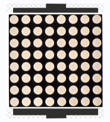**Description**

A fun way to make a small display is to use an 8x8 matrix or a 4-digit 7-segment
display. Matrices like these are 'multiplexed' - to control 64 LEDs you need 16
pins. That's a lot of pins, and there are driver chips like the MAX7219 that can
control a matrix for you. But there's a lot of wiring to set up and they take up
a ton of space. After all, wouldn't it be awesome if you could control a matrix
without tons of wiring?

We control and drive an 8\*8 LED board by the HT16K33 chip, which is convenient
for wiring and greatly save the resources of microcontroller.

1.  **Components**

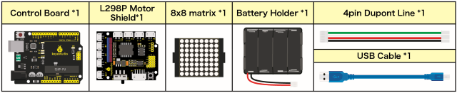

**(3) 8\*8 Dot Matrix**

Composed of LED emitting tube diodes, LED dot matrix are applied widely to
public information display like advertisement screen and bulletin board, by
controlling LED to show words, pictures and videos, etc.

Divided into single-color, double-color, and three-color lights according to
emitting color , LED dot matrix could show red, yellow, green and even true
color.

There are different types of matrices, including 4×4, 8×8 and 16×16 and etc.

The 8×8 dot matrix contains 64 LEDs.

The inner structure of 8×8 dot matrix is shown below.

Every LED is installed on the cross point of row line and column line. When the
voltage on a row line increases, and the voltage on the column line reduces, the
LED on the cross point will light up. 8×8 dot matrix has 16 pins. Put the
silk-screened side down and the numbers are 1,8, 9 and 16 in anticlockwise order
as marked below.

The definition inner pins are shown below:

For instance, to light up the LED on row 1 and column 1, you should increase the
voltage of pin 9 and reduce the voltage of pin 13.

**(4) HT16K33 8X8 Dot Matrix**

The HT16K33 is a memory mapping and multi-purpose LED controller driver. The
max. Display segment numbers in the device is 128 patterns (16 segments and 8
commons) with a 13\*3 (MAX.) matrix key scan circuit. The software configuration
features of the HT16K33 makes it suitable for multiple LED applications
including LED modules and display subsystems. The HT16K33 is compatible with
most microcontrollers and communicates via a two-line bidirectional I2C-bus.

The picture below is the working schematic of HT16K33 chip

We design the drive module of 8\*8 dot matrix based on the above principle. We
could control the dot matrix by I2C communication and two pins of
microcontroller, according to the above diagram.

**(5) Specification of 8\*8 dot matrix**

Input voltage: 5V

Rated input frequency: 400KHZ

Input power: 2.5W

Input current: 500mA

4\. Introduction for Modulus Tool

The online version of dot matrix modulus tool:

[http://dotmatrixtool.com/\##](http://dotmatrixtool.com/)

① Open the link to enter the following page.

② The dot matrix is 8\*8 in this project, so set the height to 8, width to 8, as
shown below.

Click Byte order to select“**Row major”**

③ Generate hexadecimal data from the pattern

As shown below, the left button of the mouse is for selection while the right is
for canceling. Thus you could use them to draw the pattern you want, then click
**Generate**, to yield the hexadecimal data needed.

The generated hexadecimal code(0x00, 0x66, 0x00, 0x00, 0x18, 0x42, 0x3c, 0x00)
is what will be displayed, so you need to save it for next procedure.

1.  **Connection Diagram**

****

Note: The pin G, V, SDA and SCL of dot matrix module are separately connected to
G, 5V, A4 and A5 of motor drive shield. Plug power to BAT interface.

1.  **Test Code：**

/\*

keyestudio smart turtle robot

lesson 9.1

Matrix

http://www.keyestudio.com

\*/

\##include \<Matrix.h\>

Matrix myMatrix(A4,A5); //set pins to communication pins

// define an array

uint8_t LedArray1[8]={0x00, 0x66, 0x00, 0x00, 0x18, 0x42, 0x3c, 0x00};

uint8_t LEDArray[8]; //define an array(by modulus tool) without initial value

void setup(){

myMatrix.begin(0x70); //communication address

myMatrix.clear(); //clear matrix

}

void loop(){

for(int i=0; i\<8; i++) // there is eight data, loop for eight times

{

LEDArray[i]=LedArray1[i]; //Call the emoticon array data in the subroutine
LEDArray

for(int j=7; j\>=0; j--) //Every data(byte) has 8 bit, therefore, loop for eight
times

{

if((LEDArray[i]&0x01)\>0) //judge if the last bit of data is greater than 0

{

myMatrix.drawPixel(j, i,1); //light up the corresponding point

}

else //otherwise

{

myMatrix.drawPixel(j, i,0); //turn off the corresponding point

}

LEDArray[i] = LEDArray[i]\>\>1; //LEDArray[i] moves right for one bit to judge
the previous one bit

}

}

myMatrix.writeDisplay(); // dot matrix shows

}

//

**(8) Test Result**

When uploading the code, plugging in, and turning on the robot car, the 8\*8 dot
matrix shows a smile facial pattern.

**(9) Extension Practice：**

Let’s make dot matrix draw a heart-shaped pattern. What you need to do is
entering the website and drawing the following pattern.

[http://dotmatrixtool.com/\##](http://dotmatrixtool.com/)

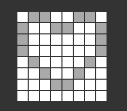，

Then we get the code of drawing the heart-shaped pattern.

Replace the above code of heart-shaped pattern, then the complete code is shown
below:

/\*

keyestudio smart turtle robot

lesson 9.2

Matrix

http://www.keyestudio.com

\*/

\##include \<Matrix.h\>

Matrix myMatrix(A4,A5); //set pins to communication pins

//define an array

uint8_t LedArray1[8]={0x66,0x99,0x81,0x81,0x42,0x24,0x18,0x00};

uint8_t LEDArray[8]; //define an array(by modulus tool) without initial value

void setup(){

myMatrix.begin(0x70); //communication address

myMatrix.clear(); //Clear

}

void loop(){

for(int i=0; i\<8; i++) // there is eight data, loop for eight times

{

LEDArray[i]=LedArray1[i]; //Call the emoticon array data in the subroutine
LEDArray

for(int j=7; j\>=0; j--) //Every data(byte) has 8 bits, therefore, loop for
eight times

{

if((LEDArray[i]&0x01)\>0) //judge if the last bit of data is greater than 0

{

myMatrix.drawPixel(j, i,1); //light up the corresponding point

}

else //otherwise

{

myMatrix.drawPixel(j, i,0); //turn off the corresponding point

}

LEDArray[i] = LEDArray[i]\>\>1; //LEDArray[i] moves right for one bit to judge
the previous one bit

}

}

myMatrix.writeDisplay(); // dot matrix shows

}

//\

Uploading code, plugging in and turning on the robot car, 8\*8 dot matrix shows
the heart-shaped pattern.

#### Project 10: Line Tracking Robot

1.  **Description**

The previous projects are inclusive of the knowledge of multiple sensors and
modules. Next, we will work on a little challenging task.

Built on the working principle of the line tracking sensor we could make a line
tracking car.

1.  **Program Process：**

| Detection | Middle tracking sensor | detects black line：HIGH |
|-----------|------------------------|--------------------------|
|           |                        | detects white line：LOW  |
|           | Left tracking sensor   | detects black line：HIGH |

detects white line：LOW

Right tracking sensor

detects black line：HIGH

detects white line：LOW

Condition 1

Status 2 detecting the left and the right tracking sensor

Status

Middle tracking sensor detects black line

left tracking sensor detects black line; right sensor detects white line

Rotate to left

（Set PWM to 200）

left tracking sensor detects white line; right sensor detects black line

Rotate to right

（ Set PWM to 200）

left and right tracking sensor detect black line

Go front（Set PWM to 200）

left and right tracking sensor detect white line

Go front（Set PWM to 200）

Middle tracking sensor detects white line

Only left line tracking sensor detects black line

Rotate to left（Set PWM to 200）

Only right line tracking sensor detects black line

Rotate to right（Set PWM to 200）

Left and right line tracking sensors detect black line

stop

Left and right line tracking sensors detect white line

stop

Flow Chart

1.  **Connection Diagram**

****

1.  **Test Code**

/\*

keyestudio smart turtle robot

lesson 10

Thacking turtle

http://www.keyestudio.com

\*/

int left_ctrl = 2;//define direction control pin of A motor

int left_pwm = 6;//define PWM control pin of A motor

int right_ctrl = 4;//define direction control pin of B motor

int right_pwm = 5;//define PWM control pin of B motor

int sensor_l = 11;//define the pin of left line tracking sensor

int sensor_c = 7;//define the pin of middle line tracking sensor

int sensor_r = 8;//define the pin of right line tracking sensor

int l_val,c_val,r_val;//define these variables

void setup() {

Serial.begin(9600);//start serial monitor and set baud rate to 9600

pinMode(left_ctrl,OUTPUT);//set direction control pin of A motor to OUTPUT

pinMode(left_pwm,OUTPUT);//set PWM control pin of A motor to OUTPUT

pinMode(right_ctrl,OUTPUT);//set direction control pin of B motor to OUTPUT

pinMode(right_pwm,OUTPUT);//set PWM control pin of B motor to OUTPUT

pinMode(sensor_l,INPUT);//set the pins of left line tracking sensor to INPUT

pinMode(sensor_c,INPUT);//set the pins of middle line tracking sensor to INPUT

pinMode(sensor_r,INPUT);//set the pins of right line tracking sensor to INPUT

}

void loop()

{

tracking(); //run main program

}

void tracking()

{

l_val = digitalRead(sensor_l);//read the value of left line tracking sensor

c_val = digitalRead(sensor_c);//read the value of middle line tracking sensor

r_val = digitalRead(sensor_r);//read the value of right line tracking sensor

if(c_val == 1)//if the state of middle one is 1, which means detecting black
line

{

front();//car goes forward

}

else

{

if((l_val == 1)&&(r_val == 0))//if only left line tracking sensor detects black
trace

{

left();//car turns left

}

else if((l_val == 0)&&(r_val == 1))///if only right line tracking sensor detects
black trace

{

right();//car turns right

}

else//if none of line tracking sensor detects black line

{

Stop();//car stops

}

}

}

void front()//define the status of going forward

{

digitalWrite(left_ctrl,LOW);

analogWrite(left_pwm,200);

digitalWrite(right_ctrl,LOW);

analogWrite(right_pwm,200);

}

void back()//define the state of going back

{

digitalWrite(left_ctrl,HIGH);

analogWrite(left_pwm,200);

digitalWrite(right_ctrl,HIGH);

analogWrite(right_pwm,200);

}

void left()//define the left-turning state

{

digitalWrite(left_ctrl,HIGH);

analogWrite(left_pwm,200);

digitalWrite(right_ctrl,LOW);

analogWrite(right_pwm,200);

}

void right()//define the right-turning state

{

digitalWrite(left_ctrl,LOW);

analogWrite(left_pwm,200);

digitalWrite(right_ctrl,HIGH);

analogWrite(right_pwm,200);

}

void Stop()//define the state of stop

{

analogWrite(left_pwm,0);

analogWrite(right_pwm,0);

}

//

1.  **Test Result**

Uploading the code to the development board, plugging in and pressing the
on-button of the robot car. Turtle car walks along black lines.

#### Project 11: Ultrasonic Follow Robot

1.  Description

In this project, we detect the distance from the obstacle to drive two motors so
as to make robot car move and 8\*8 dot matrix shows smile facial pattern.

The specific logic of ultrasonic follow robot car is shown below:

| Detection  | Measured distance of front obstacles    | distance（unit：cm） |
|------------|-----------------------------------------|----------------------|
| Setting    | Set servo to 90°                        |                      |
|            | Make dot matrix show smile face pattern |                      |
| Condition  | Distance＜8                             |                      |
| Status     | Go back（PWM set to 200）               |                      |
| Condition  | distance≥8 and distance＜13             |                      |
| Status     | Stop                                    |                      |
| Condition  | distance≥13 and distance＜35            |                      |
| Status     | Go front（PWM set to 200）              |                      |
| Condition  | distance≥35                             |                      |
| Status     | stop                                    |                      |

Flow Chart

###### Hook-up Diagram

****

1.  **Test Code**

/\*

keyestudio smart turtle robot

lesson 11

flowing turtle

http://www.keyestudio.com

\*/

int left_ctrl = 2;//define the direction control pin of A motor

int left_pwm = 6;//define the speed control pin of A motor

int right_ctrl = 4;//define the direction control pin of B motor

int right_pwm = 5;//define the speed control pin of B motor

\##include "SR04.h" //define the function library of ultrasonic sensor

\##define TRIG_PIN 12// set the signal of ultrasonic sensor to D12

\##define ECHO_PIN 13// set the signal of ultrasonic sensor to D13

SR04 sr04 = SR04(ECHO_PIN,TRIG_PIN);

long distance;

void setup() {

Serial.begin(9600);//open serial monitor and set baud rate to 9600

pinMode(left_ctrl,OUTPUT);//set direction control pin of A motor to OUTPUT

pinMode(left_pwm,OUTPUT);//set PWM control pin of A motor to OUTPUT

pinMode(right_ctrl,OUTPUT);//set direction control pin of B motor to OUTPUT

pinMode(right_pwm,OUTPUT);//set PWM control pin of B motor to OUTPUT

}

void loop() {

distance = sr04.Distance();//the distance detected by ultrasonic sensor

if(distance\<8)//if distance is less than 8

{

back();//go back

}

else if((distance\>=8)&&(distance\<13))//if 8≤distance＜13

{

Stop();//stop

}

else if((distance\>=13)&&(distance\<35))//if 13≤distance＜35

{

front();//follow

}

else//otherwise

{

Stop();//stop

}

}

void front()//define the status of going front

{

digitalWrite(left_ctrl,LOW);

analogWrite(left_pwm,200);

digitalWrite(right_ctrl,LOW);

analogWrite(right_pwm,200);

}

void back()//define the status of going back

{

digitalWrite(left_ctrl,HIGH);

analogWrite(left_pwm,200);

digitalWrite(right_ctrl,HIGH);

analogWrite(right_pwm,200);

}

void left()//define the status of turning left

{

digitalWrite(left_ctrl,HIGH);

analogWrite(left_pwm,200);

digitalWrite(right_ctrl,LOW);

analogWrite(right_pwm,200);

}

void right()//define the status of right turning

{

digitalWrite(left_ctrl,LOW);

analogWrite(left_pwm,200);

digitalWrite(right_ctrl,HIGH);

analogWrite(right_pwm,200);

}

void Stop()//define the state of stop

{

analogWrite(left_pwm,0);

analogWrite(right_pwm,0);

}

//

1.  **Test Result**

Uploading the code to the development board, and plugging in, and adjusting the
servo on the turtle robot car to 90°，dot matrix will display a smile facial
pattern and follow the obstacle to move.(This robot car can only moves forward
and backward).

#### Project 12: Ultrasonic Avoiding Robot

****

1.  **Description**

We’ve learned LED matrix, motor drive, ultrasonic sensor and servo in previous
lessons. Next, we could make an ultrasonic avoiding robot!

The measured distance between an ultrasonic sensor and obstacle can be used to
control the servo to rotate so as to make robot car move.

The specific logic of ultrasonic avoiding smart car is shown below:

| Detection   | measured distance of front obstacle  set servo to90°                                                                            | a（unit：cm）                                                                                             |
|-------------|---------------------------------------------------------------------------------------------------------------------------------|-----------------------------------------------------------------------------------------------------------|
|             | measured distance of left obstacle（set servo to 180°）                                                                         | a1（unit：cm）                                                                                            |
|             | measured distance of right obstacle （set servo to 0°）                                                                         | a2（unit：cm）                                                                                            |
| Setting     | set the initial angle of servo to 90°                                                                                           |                                                                                                           |
|             | Dot matrix shows smile face pattern                                                                                             |                                                                                                           |
| Condition1  | Status                                                                                                                          |                                                                                                           |
| a＜10       | Stop for 1000ms；set the angle of servo to 180°，read a1，delay in 500ms；set the angle of servo to 0°，read a2，delay in 500ms |                                                                                                           |
|             | Condition 2                                                                                                                     | Status                                                                                                    |
|             | a1＞a2                                                                                                                          | Set the angle of servo to 90°，rotate to left for 400ms (set PWM to 200），and go font（set PWM to 200）  |
|             | a1≤a2                                                                                                                           | Set the angle of servo to 90°，rotate to right for 400ms,（set PWM to 200，and go front（set PWM to 200） |
| Condition 1 | Status                                                                                                                          |                                                                                                           |
| a≥10        | Go front（set PWM to 200）                                                                                                      |                                                                                                           |

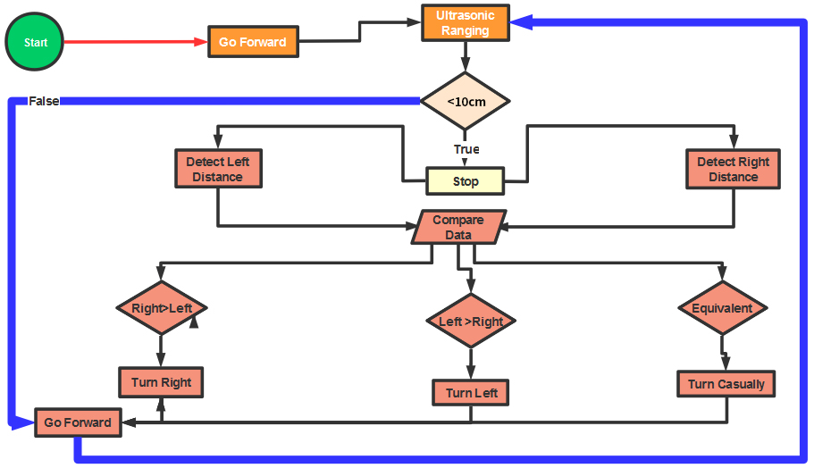

1.  **Connection Diagram**

****

1.  **Test Code**

/\*

keyestudio smart turtle robot

lesson 12

avoiding turtle

http://www.keyestudio.com

\*/

\##include \<ks_Matrix.h\>

Matrix myMatrix(A4,A5);// set the pins of dot matrix to A4 and A5.

//Array, used to store the data of pattern, can be calculated by yourself or
obtained from the modulus tool

uint8_t matrix_heart[8]={0x66,0x99,0x81,0x81,0x42,0x24,0x18,0x00};

uint8_t matrix_smile[8]={0x42,0xa5,0xa5,0x00,0x00,0x24,0x18,0x00};

uint8_t matrix_front2[8]={0x18,0x24,0x42,0x99,0x24,0x42,0x81,0x00};

uint8_t matrix_back2[8]={0x00,0x81,0x42,0x24,0x99,0x42,0x24,0x18};

uint8_t matrix_left2[8]={0x48,0x24,0x12,0x09,0x09,0x12,0x24,0x48};

uint8_t matrix_right2[8]={0x12,0x24,0x48,0x90,0x90,0x48,0x24,0x12};

uint8_t matrix_stop2[8]={0x18,0x18,0x18,0x18,0x18,0x00,0x18,0x18};

uint8_t LEDArray[8];

const int left_ctrl = 2;//define direction control pin of A motor

const int left_pwm = 6;//define PWM control pin of A motor

const int right_ctrl = 4;//define direction control pin of B motor

const int right_pwm = 5;//define PWM control pin of B motor

\##include "SR04.h"//define the library of ultrasonic sensor

\##define TRIG_PIN 12// set the signal input of ultrasonic sensor to D12

\##define ECHO_PIN 13//set the signal output of ultrasonic sensor to D13

SR04 sr04 = SR04(ECHO_PIN,TRIG_PIN);

long distance1,distance2,distance3;//define three distance

const int servopin = 10;//set the pin of servo to D10

int myangle;

int pulsewidth;

int val;

void setup() {

Serial.begin(9600);//open serial monitor and set baud rate to 9600

pinMode(left_ctrl,OUTPUT);//set direction control pin of A motor to OUTPUT

pinMode(left_pwm,OUTPUT);//set PWM control pin of A motor to OUTPUT

pinMode(right_ctrl,OUTPUT);//set direction control pin of B motor to OUTPUT

pinMode(right_pwm,OUTPUT);//set PWM control pin of B motor to OUTPUT

servopulse(servopin,90);//the angle of servo is 90 degree

delay(300);

myMatrix.begin(112);

myMatrix.clear();

}

void loop()

{

avoid();//run the main program

}

void avoid()

{

distance1=sr04.Distance(); //obtain the value detected by ultrasonic sensor

if((distance1 \< 10)&&(distance1 != 0))//if the distance is greater than 0 and
less than 10

{

car_Stop();//stop

myMatrix.clear();

myMatrix.writeDisplay();//show stop pattern

matrix_display(matrix_stop2); //show stop pattern

delay(100);

servopulse(servopin,180);//servo rotates to 180°

delay(200);

distance2=sr04.Distance();//measure the distance

delay(100);

servopulse(servopin,0);//rotate to 0 degree

delay(200);

distance3=sr04.Distance();//measure the distance

delay(100);

if(distance2 \> distance3)//compare the distance, if left distance is more than
right distance

{

car_left();//turn left

myMatrix.clear();

myMatrix.writeDisplay();

matrix_display(matrix_left2); //display left-turning pattern

servopulse(servopin,90);//servo rotates to 90 degree

//delay(50);

myMatrix.clear();

myMatrix.writeDisplay();

matrix_display(matrix_front2); //show forward pattern

}

else//if the right distance is greater than the left

{

car_right();//turn right

myMatrix.clear();

myMatrix.writeDisplay();

matrix_display(matrix_right2); //display right-turning pattern

servopulse(servopin,90);//servo rotates to 90 degree

//delay(50);

myMatrix.clear();

myMatrix.writeDisplay();

matrix_display(matrix_front2); //show forward pattern

}

}

else//otherwise

{

car_front();//go forward

myMatrix.clear();

myMatrix.writeDisplay();

matrix_display(matrix_front2); // show forward pattern

}

}

void servopulse(int servopin,int myangle)//the running angle of servo

{

for(int i=0; i\<20; i++)

{

pulsewidth = (myangle\*11)+500;

digitalWrite(servopin,HIGH);

delayMicroseconds(pulsewidth);

digitalWrite(servopin,LOW);

delay(20-pulsewidth/1000);

}

}

void car_front()//car goes forward

{

digitalWrite(left_ctrl,LOW);

analogWrite(left_pwm,200);

digitalWrite(right_ctrl,LOW);

analogWrite(right_pwm,200);

}

void car_back()//go back

{

digitalWrite(left_ctrl,HIGH);

analogWrite(left_pwm,200);

digitalWrite(right_ctrl,HIGH);

analogWrite(right_pwm,200);

}

void car_left()//car turns left

{

digitalWrite(left_ctrl,HIGH);

analogWrite(left_pwm,200);

digitalWrite(right_ctrl,LOW);

analogWrite(right_pwm,200);

}

void car_right()//car turns right

{

digitalWrite(left_ctrl,LOW);

analogWrite(left_pwm,200);

digitalWrite(right_ctrl,HIGH);

analogWrite(right_pwm,200);

}

void car_Stop()//stop

{

analogWrite(left_pwm,0);

analogWrite(right_pwm,0);

}

//this function is used for dot matrix display

void matrix_display(unsigned char matrix_value[])

{

for(int i=0; i\<8; i++)

{

LEDArray[i]=matrix_value[i];

for(int j=7; j\>=0; j--)

{

if((LEDArray[i]&0x01)\>0)

myMatrix.drawPixel(j, i,1);

LEDArray[i] = LEDArray[i]\>\>1;

}

}

myMatrix.writeDisplay();

}

1.  **Test Result**

Uploading the code on the keyestudio V4.0 board, wiring according to the
connection diagram and turning on the robot car, the smart car can automatically
avoid obstacles.

#### Project 13: IR Remote Control Robot

1.  Description

In this project, we will make IR remote control robot car!

Press the button on IR remote control to drive robot car to move, and the
corresponding state pattern is displayed on the 8\*16 LED matrix.

The specific logic of IR remote control robot car is shown below:

| Initial setup                                    | Dot matrix displays smile face |                                       |
|--------------------------------------------------|--------------------------------|---------------------------------------|
| Remote control                                   | Key Value                      | Key state                             |
|   | FF629D                         | Go front（PWM set to 200）            |
|                                                  |                                | 8\*8 LED matrix shows front icon      |
|   | FFA857                         | Back（PWM set to 200）                |
|                                                  |                                | 8\*8 LED matrix shows back icon       |
|   | FF22DD                         | Rotate to left（PWM set to 200）      |
|                                                  |                                | 8\*8 LED matrix shows leftward icon   |
|   | FFC23D                         | Rotate to right （PWM set to 200）    |
|                                                  |                                | 8\*8 LED matrix shows rightward icon  |
|   |  FF02FD                        | Stop                                  |
|                                                  |                                | 8\*8 LED matrix shows“STOP”           |
|   | FF30CF                         | Turn left                             |
|                                                  |                                | 8\*8 LED matrix shows  leftward icon  |
|   | FF7A85                         | Turn right                            |
|                                                  |                                | 8\*8 LED matrix shows  rightward icon |

**Flow Chart**

1.  **Hook-up Diagram**

****

**Note: IR receiver is connected to P4 interface.**

1.  **Test Code**

/\*

keyestudio smart turtle robot

lesson 13

remote control turtle

http://www.keyestudio.com

\*/

\##include \<ks_Matrix.h\>

Matrix myMatrix(A4,A5);

//Array, used to store the data of pattern, can be calculated by yourself or
obtained from the modulus tool

uint8_t matrix_heart[8]={0x66,0x99,0x81,0x81,0x42,0x24,0x18,0x00};

uint8_t matrix_smile[8]={0x42,0xa5,0xa5,0x00,0x00,0x24,0x18,0x00};

uint8_t matrix_front2[8]={0x18,0x24,0x42,0x99,0x24,0x42,0x81,0x00};

uint8_t matrix_back2[8]={0x00,0x81,0x42,0x24,0x99,0x42,0x24,0x18};

uint8_t matrix_left2[8]={0x48,0x24,0x12,0x09,0x09,0x12,0x24,0x48};

uint8_t matrix_right2[8]={0x12,0x24,0x48,0x90,0x90,0x48,0x24,0x12};

uint8_t matrix_stop2[8]={0x18,0x18,0x18,0x18,0x18,0x00,0x18,0x18};

uint8_t LEDArray[8];

const int left_ctrl = 4;//define the direction control pin of A motor

const int left_pwm = 5;//define the speed control of A motor

const int right_ctrl = 2;//define the direction control pin of B motor

const int right_pwm = 6;//define the speed control pin of B motor

\##include \<IRremote.h\>//function library of IR remote control

int RECV_PIN = A1;//set the pin of IR receiver to A1

IRrecv irrecv(RECV_PIN);

long irr_val;

decode_results results;

void setup()

{

pinMode(left_ctrl,OUTPUT);//

pinMode(left_pwm,OUTPUT);//

pinMode(right_ctrl,OUTPUT);//

pinMode(right_pwm,OUTPUT);//

Serial.begin(9600);//

// In case the interrupt driver crashes on setup, give a clue

// to the user what's going on.

Serial.println("Enabling IRin");

irrecv.enableIRIn(); // Start the receiver

Serial.println("Enabled IRin");

myMatrix.begin(112);

myMatrix.clear();

}

void loop()

{

if (irrecv.decode(&results))

{

irr_val = results.value;

Serial.println(irr_val, HEX);//serial prints the read IR remote signals

switch(irr_val)

{

case 0xFF629D : car_front();

myMatrix.clear();

myMatrix.writeDisplay();

matrix_display(matrix_front2);

break;

case 0xFFA857 : car_back();

myMatrix.clear();

myMatrix.writeDisplay();

matrix_display(matrix_back2);

break;

case 0xFF22DD : car_left();

myMatrix.clear();

myMatrix.writeDisplay();

matrix_display(matrix_left2);

break;

case 0xFFC23D : car_right();

myMatrix.clear();

myMatrix.writeDisplay();

matrix_display(matrix_right2);

break;

case 0xFF02FD : car_Stop();

myMatrix.clear();

myMatrix.writeDisplay();

matrix_display(matrix_stop2);

break;

}

irrecv.resume(); // Receive the next value

}

}

void car_front()//define the state of going front

{

digitalWrite(left_ctrl,LOW);

analogWrite(left_pwm,200);

digitalWrite(right_ctrl,LOW);

analogWrite(right_pwm,200);

}

void car_back()//define the status of going back

{

digitalWrite(left_ctrl,HIGH);

analogWrite(left_pwm,200);

digitalWrite(right_ctrl,HIGH);

analogWrite(right_pwm,200);

}

void car_left()//set the status of left turning

{

digitalWrite(left_ctrl,LOW);

analogWrite(left_pwm,200);

digitalWrite(right_ctrl,HIGH);

analogWrite(right_pwm,200);

}

void car_right()//set the status of right turning

{

digitalWrite(left_ctrl,HIGH);

analogWrite(left_pwm,200);

digitalWrite(right_ctrl,LOW);

analogWrite(right_pwm,200);

}

void car_Stop()//define the state of stop

{

analogWrite(left_pwm,0);

analogWrite(right_pwm,0);

}

//The function that dot matrix shows pattern

void matrix_display(unsigned char matrix_value[])

{

for(int i=0; i\<8; i++)

{

LEDArray[i]=matrix_value[i];

for(int j=7; j\>=0; j--)

{

if((LEDArray[i]&0x01)\>0)

myMatrix.drawPixel(j, i,1);

LEDArray[i] = LEDArray[i]\>\>1;

}

}

myMatrix.writeDisplay();

}

1.  **Test Result**

Upload code and press buttons on IR remote control to make turtle robot car to
move.

#### Project 14: Bluetooth Remote Control

****

1.  **Description**

We’ve learned the basic knowledge of Bluetooth. And in this lesson, we will make
a Bluetooth remote smart car. In this experiment, we default the HM-10 Bluetooth
module as a Slave and the cellphone as a Host.

keyes BT car is an APP rolled out by keyestudio team. You can control the robot
car by it readily.

1.  **Test the key value of App**

Special note: before uploading the test code, you need to remove the Bluetooth
module. Otherwise, the test code will fail to upload. You can reconnect the
Bluetooth module when the code is uploaded successfully.

/\*

keyestudio

lesson 14.1

Bluetooth test

http://www.keyestudio.com

\*/

char BLE_val;

void setup()

{

Serial.begin(9600);

}

void loop()

{

if(Serial.available()\>0)

{

BLE_val = Serial.read();

Serial.println(BLE_val);

}

}

Upload code to V4.0 development board, and connect to Bluetooth module, as shown
below:

****

Insert a Bluetooth module, LED indicator of Bluetooth module will flash. Next,
download the App.

Special note: RXD, TXD, GND and VCC of Bluetooth module are respectively
connected to TX, RX, -（GND）and +（VCC）. The STATE and BRK pins don’t need to
be connected.

The pin G, V, SDA and SCL of dot matrix are linked with G, 5V, A4 and A5
separately. Plug power to BAT interface.

For iOS system

Search keyes BT car in App store

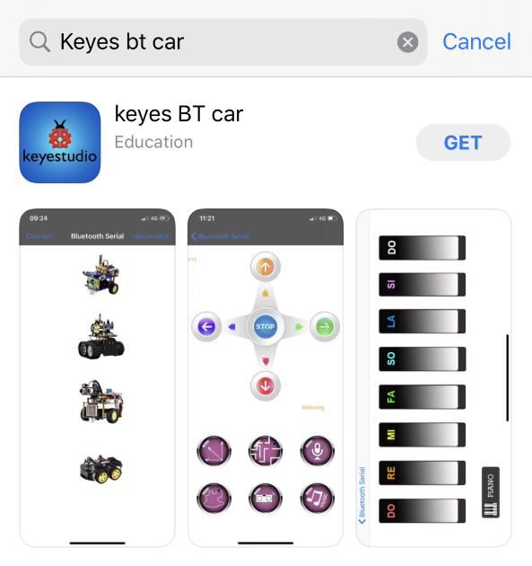

After installation, enter its interface.

Click“Connect”to search and pair Bluetooth.

5.Clickto enter the main page of
turtle smart car.

**For Android System**

1\. Enter Google play store to search for Turtle Car(**allow APP to
access“location”, you could enable “location”in settings of your cellphone.**

1.  The app icon is shown below after installation.

    

2.  Click app to enter the following page.

1.  After connecting Bluetooth, plug in power and LED indicator of Bluetooth
    module will flicker. Tap
    to
    search Bluetooth.

    

(4) Click“connect”below HMSoft, then the Bluetooth will be connected and its LED
indicator will stay on.

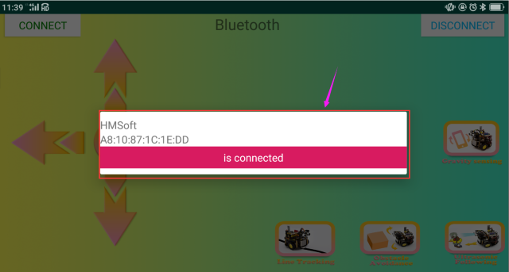

After connecting Bluetooth module, open serial monitor to set baud rate to 9600.
Pressing the button of the Bluetooth APP, and the corresponding characters are
displayed as shown below:

|  | Pair HM-10 Bluetooth module     |                                                                 |
|----------------------------------------------------------------------------------|---------------------------------|-----------------------------------------------------------------|
|  | Enter control page of Bluetooth |                                                                 |
|  | Disconnect Bluetooth            |                                                                 |
|                                   | Press: F Release: S             | Press the button, robot goes front; release to stop             |
|                                   | Press: L Release: S             | Press the button, robot turns left; release to stop             |
|                                   | Click to send “S”               | Stop                                                            |
|                                   | Press: R Release: S             | Press the button, robot turns right; release to stop            |
|                                   | Press: B Release: S             | Press the button, robot goes back; release to stop              |
|                                   | Click to send “Y”               | Start Ultrasonic follow function; click Stop to exit            |
|                                   | ---                             | Click to start the mobile gravity sensing; click again to exit  |
|                                   | Click to send “U”               | Start ultrasonic avoiding function; click Stop to exit          |
|                                   | Click to send “X”               | Start line tracking function; click Stop to exit                |

We have read the characters of each key on mobile APP via serial port and know
the function of those keys.

Flow Chart

****

1.  **Connection Diagram**

****

1.  **Test Code**

/\*

keyestudio smart turtle robot

lesson 14.2

Bluetooth Control turtle

http://www.keyestudio.com

\*/

\##include \<ks_Matrix.h\>

Matrix myMatrix(A4,A5);

//Array, used to store the data of pattern, can be calculated by yourself or
obtained from the modulus tool

uint8_t matrix_heart[8]={0x66,0x99,0x81,0x81,0x42,0x24,0x18,0x00};

uint8_t matrix_smile[8]={0x42,0xa5,0xa5,0x00,0x00,0x24,0x18,0x00};

uint8_t matrix_front2[8]={0x18,0x24,0x42,0x99,0x24,0x42,0x81,0x00};

uint8_t matrix_back2[8]={0x00,0x81,0x42,0x24,0x99,0x42,0x24,0x18};

uint8_t matrix_left2[8]={0x48,0x24,0x12,0x09,0x09,0x12,0x24,0x48};

uint8_t matrix_right2[8]={0x12,0x24,0x48,0x90,0x90,0x48,0x24,0x12};

uint8_t matrix_stop2[8]={0x18,0x18,0x18,0x18,0x18,0x00,0x18,0x18};

uint8_t LEDArray[8];

unsigned char data_line = 0;

unsigned char delay_count = 0;

const int left_ctrl = 2;//define direction control pin of A motor

const int left_pwm = 6;//define PWM control pin of A motor

const int right_ctrl = 4;//define direction control pin of B motor

const int right_pwm = 5;//define PWM control pin of B motor

char BLE_val;

void setup()

{

Serial.begin(9600);

pinMode(left_ctrl,OUTPUT);

pinMode(left_pwm,OUTPUT);

pinMode(right_ctrl,OUTPUT);

pinMode(right_pwm,OUTPUT);

myMatrix.begin(112);

myMatrix.clear();

}

void loop()

{

if(Serial.available()\>0)

{

BLE_val = Serial.read();

Serial.println(BLE_val);

}

switch(BLE_val)

{

case 'F': car_front();

myMatrix.clear();

myMatrix.writeDisplay();

matrix_display(matrix_front2);

break;

case 'B': car_back();

myMatrix.clear();

myMatrix.writeDisplay();

matrix_display(matrix_back2);

break;

case 'L': car_left();

myMatrix.clear();

myMatrix.writeDisplay();

matrix_display(matrix_left2);

break;

case 'R': car_right();

myMatrix.clear();

myMatrix.writeDisplay();

matrix_display(matrix_right2);

break;

case 'S': car_Stop();

myMatrix.clear();

myMatrix.writeDisplay();

matrix_display(matrix_stop2);

break;

}

}

void car_front()//go front

{

digitalWrite(left_ctrl,LOW);

analogWrite(left_pwm,200);

digitalWrite(right_ctrl,LOW);

analogWrite(right_pwm,200);

}

void car_back()//go backward

{

digitalWrite(left_ctrl,HIGH);

analogWrite(left_pwm,200);

digitalWrite(right_ctrl,HIGH);

analogWrite(right_pwm,200);

}

void car_left()//turn left

{

digitalWrite(left_ctrl,HIGH);

analogWrite(left_pwm,200);

digitalWrite(right_ctrl,LOW);

analogWrite(right_pwm,200);

}

void car_right()//turn right

{

digitalWrite(left_ctrl,LOW);

analogWrite(left_pwm,200);

digitalWrite(right_ctrl,HIGH);

analogWrite(right_pwm,200);

}

void car_Stop()//stop

{

analogWrite(left_pwm,0);

analogWrite(right_pwm,0);

}

// the function that dot matrix shows patterns

void matrix_display(unsigned char matrix_value[])

{

for(int i=0; i\<8; i++)

{

LEDArray[i]=matrix_value[i];

for(int j=7; j\>=0; j--)

{

if((LEDArray[i]&0x01)\>0)

myMatrix.drawPixel(j, i,1);

LEDArray[i] = LEDArray[i]\>\>1;

}

}

myMatrix.writeDisplay();

}

//

1.  **Test Result**

Uploading the program to development board, inserting Bluetooth module and
opening the App to connect with Bluetooth, we can control the turtle robot car
to move through icons on the App.

Special Note: you need to remove the Bluetooth module before uploading the test
code. Otherwise, the test code will fail to upload.

And the Bluetooth module can be reconnected after uploading code successfully.

#### Project 15: Multi-purpose Bluetooth Robot

1.  **Description**

In previous projects, the turtle robot car only performs a single function.
However, in this lesson, we will integrate all of its functions via Bluetooth
control.

Here is a simple flow chart of this multi-purpose robot car for your reference.

1.  **Connection Diagram**

****

1.  **Test Code**

/\*

keyestudio smart turtle robot

lesson 15

Multifunctional turtle robot

http://www.keyestudio.com

\*/

\##include \<ks_Matrix.h\>

Matrix myMatrix(A4,A5);

//Array, used to store the data of pattern, can be calculated by yourself or
obtained from the modulus tool

uint8_t matrix_heart[8]={0x66,0x99,0x81,0x81,0x42,0x24,0x18,0x00};

uint8_t matrix_smile[8]={0x42,0xa5,0xa5,0x00,0x00,0x24,0x18,0x00};

uint8_t matrix_front2[8]={0x18,0x24,0x42,0x99,0x24,0x42,0x81,0x00};

uint8_t matrix_back2[8]={0x00,0x81,0x42,0x24,0x99,0x42,0x24,0x18};

uint8_t matrix_left2[8]={0x48,0x24,0x12,0x09,0x09,0x12,0x24,0x48};

uint8_t matrix_right2[8]={0x12,0x24,0x48,0x90,0x90,0x48,0x24,0x12};

uint8_t matrix_stop2[8]={0x18,0x18,0x18,0x18,0x18,0x00,0x18,0x18};

uint8_t LEDArray[8];

\##include "SR04.h"

\##define TRIG_PIN 12

\##define ECHO_PIN 13

SR04 sr04 = SR04(ECHO_PIN,TRIG_PIN);

long distance,distance1,distance2,distance3;

const int left_ctrl = 2;

const int left_pwm = 6;

const int right_ctrl = 4;

const int right_pwm = 5;

const int sensor_l = 11;

const int sensor_c = 7;

const int sensor_r = 8;

int l_val,c_val,r_val;

const int servopin = 10;

int myangle;

int pulsewidth;

int val;

char BLE_val;

void setup() {

Serial.begin(9600);

//irrecv.enableIRIn(); // Start the receiver

servopulse(servopin,90);

pinMode(left_ctrl,OUTPUT);

pinMode(left_pwm,OUTPUT);

pinMode(right_ctrl,OUTPUT);

pinMode(right_pwm,OUTPUT);

pinMode(sensor_l,INPUT);

pinMode(sensor_c,INPUT);

pinMode(sensor_r,INPUT);

myMatrix.begin(112);

myMatrix.clear();

myMatrix.writeDisplay();

}

void loop() {

if(Serial.available()\>0)

{

BLE_val = Serial.read();

Serial.println(BLE_val);

}

switch(BLE_val)

{

case 'F': car_front();

myMatrix.clear();

myMatrix.writeDisplay();

matrix_display(matrix_front2);

break;

case 'B': car_back();

myMatrix.clear();

myMatrix.writeDisplay();

matrix_display(matrix_back2);

break;

case 'L': car_left();

myMatrix.clear();

myMatrix.writeDisplay();

matrix_display(matrix_left2);

break;

case 'R': car_right();

myMatrix.clear();

myMatrix.writeDisplay();

matrix_display(matrix_right2);

break;

case 'S': car_Stop();

myMatrix.clear();

myMatrix.writeDisplay();

matrix_display(matrix_stop2);

break;

case 'X': tracking();

break;

case 'Y': follow_car();

break;

case 'U': avoid();

break;

}

}

void avoid()

{

myMatrix.clear();

myMatrix.writeDisplay();

matrix_display(matrix_smile);

int track_flag = 0;

while(track_flag == 0)

{

distance1=sr04.Distance();

if((distance1 \< 10)&&(distance1 != 0))

{

car_Stop();

myMatrix.clear();

myMatrix.writeDisplay();

matrix_display(matrix_stop2);

delay(100);

servopulse(servopin,180);

delay(100);

distance2=sr04.Distance();

delay(100);

servopulse(servopin,0);

delay(100);

distance3=sr04.Distance();

delay(100);

if(distance2 \> distance3)

{

car_left();

myMatrix.clear();

myMatrix.writeDisplay();

matrix_display(matrix_left2);

servopulse(servopin,90);

//delay(100);

}

else

{

car_right();

myMatrix.clear();

myMatrix.writeDisplay();

matrix_display(matrix_right2);

servopulse(servopin,90);

//delay(100);

}

}

else

{

car_front();

myMatrix.clear();

myMatrix.writeDisplay();

matrix_display(matrix_front2);

}

if(Serial.available()\>0)

{

BLE_val = Serial.read();

if(BLE_val == 'S')

{

track_flag = 1;

}

}

}

}

void follow_car()

{

servopulse(servopin,90);

int track_flag = 0;

while(track_flag == 0)

{

distance = sr04.Distance();

if(distance\<8)

{

car_back();

myMatrix.clear();

myMatrix.writeDisplay();

matrix_display(matrix_back2);

}

else if((distance\>=8)&&(distance\<13))

{

car_Stop();

myMatrix.clear();

myMatrix.writeDisplay();

matrix_display(matrix_stop2);

}

else if((distance\>=13)&&(distance\<35))

{

car_front();

myMatrix.clear();

myMatrix.writeDisplay();

matrix_display(matrix_front2);

}

else

{

car_Stop();

myMatrix.clear();

myMatrix.writeDisplay();

matrix_display(matrix_stop2);

}

if(Serial.available()\>0)

{

BLE_val = Serial.read();

if(BLE_val == 'S')

{

track_flag = 1;

}

}

}

}

void servopulse(int servopin,int myangle)

{

for(int i=0;i\<20;i++)

{

pulsewidth = (myangle\*11)+500;

digitalWrite(servopin,HIGH);

delayMicroseconds(pulsewidth);

digitalWrite(servopin,LOW);

delay(20-pulsewidth/1000);

}

}

void tracking()

{

myMatrix.clear();

myMatrix.writeDisplay();

matrix_display(matrix_smile);

int track_flag = 0;

while(track_flag == 0)

{

l_val = digitalRead(sensor_l);

c_val = digitalRead(sensor_c);

r_val = digitalRead(sensor_r);

if(c_val == 1)

{

car_front2();

myMatrix.clear();

myMatrix.writeDisplay();

matrix_display(matrix_front2);

}

else

{

if((l_val == 1)&&(r_val == 0))

{

car_left();

myMatrix.clear();

myMatrix.writeDisplay();

matrix_display(matrix_left2);

}

else if((l_val == 0)&&(r_val == 1))

{

car_right();

myMatrix.clear();

myMatrix.writeDisplay();

matrix_display(matrix_right2);

}

else

{

car_Stop();

myMatrix.clear();

myMatrix.writeDisplay();

matrix_display(matrix_stop2);

}

}

if(Serial.available()\>0)

{

BLE_val = Serial.read();

if(BLE_val == 'S')

{

track_flag = 1;

}

}

}

}

void car_front()

{

digitalWrite(left_ctrl,LOW);

analogWrite(left_pwm,200);

digitalWrite(right_ctrl,LOW);

analogWrite(right_pwm,200);

}

void car_front2()

{

digitalWrite(left_ctrl,LOW);

analogWrite(left_pwm,100);

digitalWrite(right_ctrl,LOW);

analogWrite(right_pwm,100);

}

void car_back()

{

digitalWrite(left_ctrl,HIGH);

analogWrite(left_pwm,200);

digitalWrite(right_ctrl,HIGH);

analogWrite(right_pwm,200);

}

void car_left()

{

digitalWrite(left_ctrl,HIGH);

analogWrite(left_pwm,200);

digitalWrite(right_ctrl,LOW);

analogWrite(right_pwm,200);

}

void car_right()

{

digitalWrite(left_ctrl,LOW);

analogWrite(left_pwm,200);

digitalWrite(right_ctrl,HIGH);

analogWrite(right_pwm,200);

}

void car_Stop()

{

analogWrite(left_pwm,0);

analogWrite(right_pwm,0);

}

//the function that dot matrix shows patterns

void matrix_display(unsigned char matrix_value[])

{

for(int i=0; i\<8; i++)

{

LEDArray[i]=matrix_value[i];

for(int j=7; j\>=0; j--)

{

if((LEDArray[i]&0x01)\>0)

myMatrix.drawPixel(j, i,1);

LEDArray[i] = LEDArray[i]\>\>1;

}

}

myMatrix.writeDisplay();

}

//

**（5）Test Result**

Uploading code to development board, plugging in and turning on it , the turtle
robot car can not only go forward and back but turn left and right. Moreover, it
is known that the mobile APP, connected to Bluetooth successfully, can be used
to control the movement of the car.

## 8.Resources

Wiki page: <https://wiki.keyestudio.com/Main_Page>

Official website: <https://keyestudio.com/>
